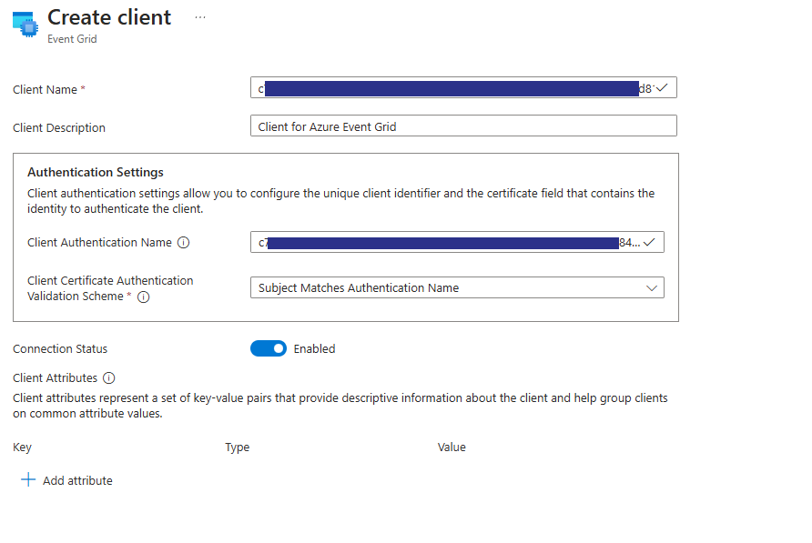
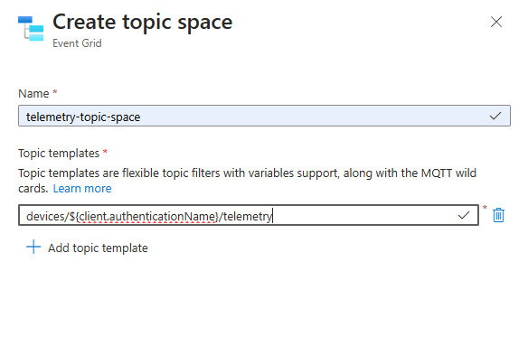
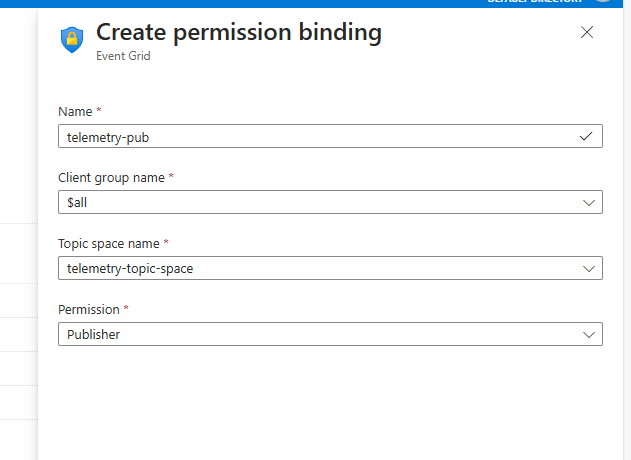
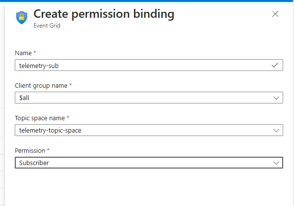

# Project: Azure Sphere - Azure Event Grid 

The goal of this project is to show how to connect an Azure Sphere device to the Azure Event Grid service to publish and subscribe to messages over MQTT v3.1.1 protocol, making use of Azure Sphere's [DAA certificates](https://learn.microsoft.com/azure-sphere/deployment/certificate-use-with-azure-sphere?view=azure-sphere-integrated#azure-sphere-devices) for secure, authenticated, and attested connectivity. This project uses the [MQTT-C](https://github.com/LiamBindle/MQTT-C) library to establish an MQTT v3.1.1 connection to Azure Event Grid.

This project both publishes and subscribes to the MQTT [topic space](https://learn.microsoft.com/azure/event-grid/mqtt-topic-spaces) `devices/${client.authenticationName}/telemetry`.

> **Note:** **This project is not intended as production-ready code and should be used only for evaluation purposes.** In particular we strongly recommend careful consideration of your own choice of MQTT client library for production use to ensure it meets your requirements, especially for ongoing security and maintenance. The open source MQTT-C library used here has been chosen because of its permissive MIT license, for easy evaluation of Azure Event Grid capability, and has not been evaluated for security and support in a production scenario.


## Prerequisites
1. The project requires the following hardware:

   - An [Azure Sphere development board](https://aka.ms/azurespheredevkits) that supports the [Sample Appliance](../../../HardwareDefinitions) hardware requirements.

   **Note:** By default, the project targets the [Reference Development Board](https://learn.microsoft.com/azure-sphere/hardware/mt3620-reference-board-design) design, which is implemented by the Seeed Studios MT3620 Development Board. To build the project for different Azure Sphere hardware, change the value of the TARGET_HARDWARE variable in the `CMakeLists.txt` file. For further information see [use hardware definitions](https://learn.microsoft.com/azure-sphere/app-development/manage-hardware-dependencies?view=azure-sphere-integrated)
1. MQTT-C library is included via a submodule. Ensure that you initialize, fetch and checkout submodules for this repo.
    ```
    git submodule update --init --recursive
    ```
1. We encourage you to familiarize yourself with:
   - The [MQTT-C documentation](https://github.com/LiamBindle/MQTT-C) to understand the MQTT-C library.
   - [Event Grid overview](https://learn.microsoft.com/azure/event-grid/overview) before starting this project. Here is a helpful list of [terminologies](https://learn.microsoft.com/azure/event-grid/mqtt-event-grid-namespace-terminology) that explains the key terms relevant for Azure Event Grid.
1. An Azure subscription. If your organization does not already have a subscription, you can set up a [free trial subscription](https://azure.microsoft.com/free/?v=17.15).

## Setup
1. Ensure that your Azure Sphere device is connected to your computer, and your computer is connected to the internet.
1. Ensure that you have Azure Sphere SDK installed for [Windows](https://learn.microsoft.com/azure-sphere/install/install-sdk) or [Linux](https://learn.microsoft.com/azure-sphere/install/install-sdk-linux) as needed.
1. Ensure that the [Azure CLI](https://learn.microsoft.com/cli/azure/install-azure-cli) is installed. At a minimum, the Azure CLI version must be 2.45.0 or later.
1. Install the [Azure Sphere extension](https://learn.microsoft.com/azure-sphere/reference/cli/overview?view=azure-sphere-integrated).
1. Enable application development, if you have not already done so, by entering the `az sphere device enable-development` command in the [command prompt](https://learn.microsoft.com/azure-sphere/reference/cli/overview?view=azure-sphere-integrated).
1. If you don't already have openSSL, you can download a recommended installation package from [openssl.org’s official wiki page]( https://wiki.openssl.org/index.php/Binaries) and install it your PC.

## Setup your project
1. Create an Azure Event Grid instance in the Azure portal. 
   Follow the [instructions to create a namespace](https://learn.microsoft.com/azure/event-grid/mqtt-publish-and-subscribe-portal#create-a-namespace) to create an Event Grid instance.

1. Upload the catalog CA certificate.

   Azure Event Grid's MQTT broker supports certificate-based authentication to establish a secure connection.
     1. [Download the catalog CA certificate](https://learn.microsoft.com/azure-sphere/deployment/az-certificate-download?view=azure-sphere-integrated) using the portal or the Azure Sphere Extension for the Azure CLI.
     1. Convert the certificate to PEM format using the following command: 
     
        ```
        openssl x509 -in CAcertificate.cer -out CAcertificate.pem
        ```
     
     1. Follow these instructions to [upload the catalog CA certificate to Azure Event Grid](https://learn.microsoft.com/azure/event-grid/mqtt-certificate-chain-client-authentication#upload-the-ca-certificate-to-the-namespace).
     
     Refer to [MQTT client authentication using certificates](https://learn.microsoft.com/azure/event-grid/mqtt-client-certificate-authentication) for more information.

1. Configure the client authentication settings in Azure Event Grid.

     Azure Event Grid's MQTT broker supports authentication of clients using X.509 certificates. 
 
     Follow these instructions to [configure client authentication](https://learn.microsoft.com/azure/event-grid/mqtt-certificate-chain-client-authentication#configure-client-authentication-settings).

     - **Client Name** - Set a name for the client. If you prefer, the client name can be different from the Client Authentication Name.
     - **Client Authentication Name** - Set the device ID of your Azure Sphere device as the client authentication name. Run the [`az sphere device show-attached`](https://learn.microsoft.com/en-gb/azure-sphere/reference/cli/azsphere-device?view=azure-sphere-integrated#az-sphere-device-show-attached) command to obtain the Device ID.
     - **Client Certificate Authentication Validation Scheme** - Set to "Subject Matches Authentication Name". 
    
     
     


     Refer to [MQTT clients](https://learn.microsoft.com/azure/event-grid/mqtt-clients) for more information.

1. Create a topic space in the Event Grid instance. 

   Topic space is a set of topic templates. It's used to simplify access control management by enabling you to scope publish or subscribe access for a client group, to a group of topics at once instead of individual topics. 

   Follow these instructions to [create a topic space](https://learn.microsoft.com/azure/event-grid/mqtt-publish-and-subscribe-portal#create-topic-spaces).
   - Provide any name for the topic space, for example `telemetry-topic-space`.
   - Use `devices/${client.authenticationName}/telemetry` as the topic template for this sample.
     This sample uses granular access control to control the authorization of each client. Refer to [granular access control](https://learn.microsoft.com/azure/event-grid/mqtt-access-control#granular-access-control) for further information. 
   
   

   Refer to [topic spaces](https://learn.microsoft.com/azure/event-grid/mqtt-topic-spaces) for more information.

1. Create permission bindings
   A permission binding grants access to a specific client group to either publish or subscribe on a specific topic space. Follow these instructions to [create permission bindings](https://learn.microsoft.com/azure/event-grid/mqtt-publish-and-subscribe-portal#configuring-access-control-using-permission-bindings).
   
   **Note:** Make sure to set both Publisher and Subscriber permission bindings.
   
   - Publisher binding:
   
   

   - Subscriber binding:
   
   

   Refer to [Access control for MQTT clients](https://learn.microsoft.com/azure/event-grid/mqtt-access-control) for more information on permission bindings.

### Modify the project Application Manifest
Update the following items in the application manifest:
1. **CmdArgs** field of the app_manifest.json file:
   - In the Azure portal, from the overview section of the Event Grid instance, copy the "MQTT hostname"" and replace `<your_event_grid_mqtt_hostname>` in the **CmdArgs** field of the app_manifest.json file with the value of your MQTT hostname. Your **CmdArgs** field should now look like:

        `"CmdArgs": [ "--Hostname", "<your_event_grid_mqtt_hostname.ts.eventgrid.azure.net>" ]`
1. **AllowedConnections** field of the app_manifest.json file.From the overview section of the Event Grid instance, copy the "MQTT hostname" and replace `<your_event_grid_mqtt_hostname>` in the `AllowedConnections` section of the `app_manifest.json` file.
   - Copy the hostname used in the **CmdArgs** field and append it to the **AllowedConnections** field of the app_manifest.json file. The field should now look like:

     `"AllowedConnections": [ "<your_event_grid_mqtt_hostname.ts.eventgrid.azure.net>" ]`
1. **DeviceAuthentication** field of the app_manifest.json file.

   - [Retrieve your catalog details](https://learn.microsoft.com/azure-sphere/deployment/az-catalog-show?view=azure-sphere-integrated) to get the Azure Sphere Catalog ID. Use the GUID, not the friendly name, and paste it into the **DeviceAuthentication** field of the app_manifest.json file:

   - Your **DeviceAuthentication** field should now look like:

     `"DeviceAuthentication": "<GUID>"`
   
## How to use the project
Build and run the project. The project publishes a simulated temperature to the topic `devices/$\{client.authenticationName\}/telemetry`. It also subscribes to the same topic, and hence receives the messages that are published.

## Project expectations

The code has been developed to show how to integrate Azure Event Grid into an Azure Sphere project - It is not official, maintained, or production-ready code.

### Expected support for the code

This code is not formally maintained, but we will make a best effort to respond to/address any issues you encounter.

### How to report an issue

If you run into an issue with this code, please open a GitHub issue against this repo.

## Contributing

This project welcomes contributions and suggestions. Most contributions require you to
agree to a Contributor License Agreement (CLA) declaring that you have the right to,
and actually do, grant us the rights to use your contribution. For details, visit
https://cla.microsoft.com.

When you submit a pull request, a CLA-bot will automatically determine whether you need
to provide a CLA and decorate the PR appropriately (e.g., label, comment). Simply follow the
instructions provided by the bot. You will only need to do this once across all repositories using our CLA.

This project has adopted the [Microsoft Open Source Code of Conduct](https://opensource.microsoft.com/codeofconduct/).
For more information see the [Code of Conduct FAQ](https://opensource.microsoft.com/codeofconduct/faq/)
or contact [opencode@microsoft.com](mailto:opencode@microsoft.com) with any additional questions or comments.

## License

See [LICENSE.txt](./LICENSE.txt)

- MQTT-C is included via a submodule. The license for MQTT-C can be [found here](https://github.com/LiamBindle/MQTT-C/blob/master/LICENSE).
