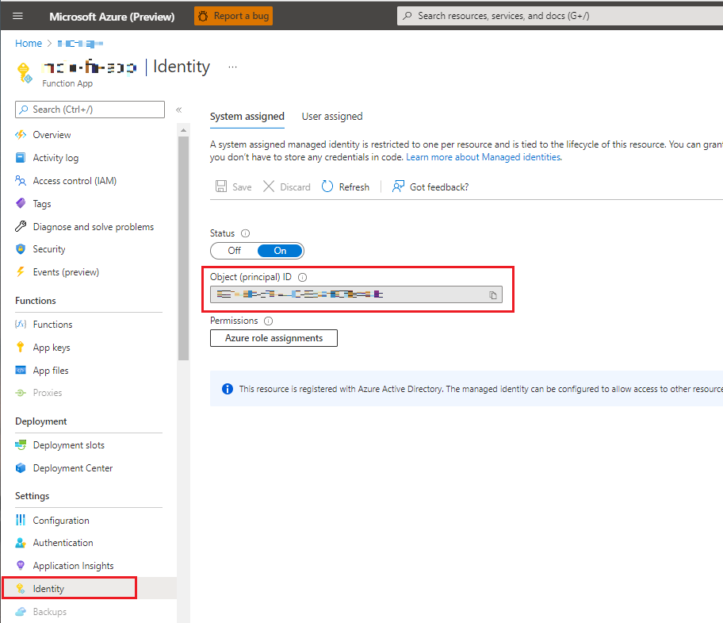
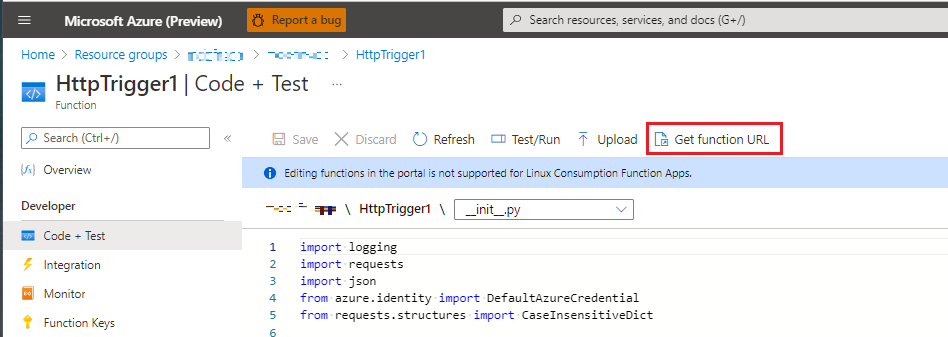

# AzureFunctionApp-AzureSpherePublicAPI project

The goal of this project is to show how to use the Azure Sphere Public API in a Python Azure Function App.

## Contents

| File/folder | Description |
|-------------|-------------|
| `src\__init__.py`       | Python function app source |
| `assets` | Images used in this README file |
| `README.md` | This README file. |
| `LICENSE.txt`   | The license for the project. |

## Prerequisites & Setup

- Setup a development environment for Azure Sphere (see [Quickstarts to set up your Azure Sphere device](https://learn.microsoft.com/azure-sphere/install/overview) for more information).
- An Azure Sphere-based device with development features (see [Get started with Azure Sphere](https://azure.microsoft.com/services/azure-sphere/get-started/) for more information).
- One or more Azure Sphere tenants (see [About tenants](https://learn.microsoft.com/azure-sphere/deployment/about-tenants) for more information).

## How to use

Get started by creating an Azure Function App that supports Python development (see [Quickstart: Create a function in Azure with Python using Visual Studio Code](https://learn.microsoft.com/azure/azure-functions/create-first-function-vs-code-python) for more information).

Deploy the Python Function App to Azure and test the HttpTrigger is working.

Enable `System Assigned Managed Service Identity` for the Function App by locating your Function App in the Azure Portal, selecting `Identity` and turning on the `System assigned` identity.



Copy the `Object (principal) ID`, you will need this later.

The [Azure Sphere Public API](https://learn.microsoft.com/rest/api/azure-sphere) requires an authentication token in REST API calls, the token is obtained through the Function App `Service Principal` which is linked to a user in your Azure Sphere tenant (details on creating the user are below).

You will need the following:
* Azure Sphere device claimed into a tenant
* **Azure Sphere Tenant Id** Use the Azure Sphere command line interface (CLI) and run `azsphere tenant show-selected` (you can also use the `azsphere tenant list` and `azsphere tenant select` commands to select a different tenant).
* **Azure Subscription/Tenant Id** Log into the [Azure Portal](https://portal.azure.com) and search for `tenant`, select `tenant properties` and copy the Tenant Id (this will be a GUID)

### Add the Azure Sphere Application to your Azure Tenant (one time setup)

* Open Powershell (in Administrative mode) - and install the Azure AD module (you may need to install the NuGet provider, confirm the warning for *"Untrusted repository"*)

```cmd
Install-Module AzureAD
```

* Run the following commands (you'll be asked to sign-in):

```cmd
Connect-AzureAD -TenantId <<Your Azure Tenant Id>>
```
Note that the GUID used in the following command is a fixed value and defines the Azure Sphere API Application ID which needs to be added to your tenant.

**Note:** you'll need administrator rights in your Microsoft AD Tenant to run this command.

```cmd
New-AzureADServicePrincipal -AppId 7c209960-a417-423c-b2e3-9251907e63fe -DisplayName "Azure Sphere API"
```

### Register the `Service Principal` user in the Azure Sphere tenant.

You will need:

* Your Azure Sphere Tenant Id `azsphere tenant show-selected`
* The Function App Managed Service Identity `Object (principal) ID`
* Your Azure Active Directory Tenant Id (Guid)

Use the following commands to register a new user in your Azure Sphere tenant.

Here's a key to the commands below:

| Item | Description |
|-------------|-------------|
| tttttttt-tttt-tttt-tttt-tttttttttttt | Azure Sphere Tenant Id |
| xxxxxxxx-xxxx-xxxx-xxxx-xxxxxxxxxxxx | Function App's `Object (principal) ID` |
| zzzzzzzz-zzzz-zzzz-zzzz-zzzzzzzzzzzz | Azure Tenant Id |


```cmd
azsphere login
azsphere tenant select --tenantid tttttttt-tttt-tttt-tttt-tttttttttttt
azsphere register-user --new-user  xxxxxxxx-xxxx-xxxx-xxxx-xxxxxxxxxxxx@zzzzzzzz-zzzz-zzzz-zzzz-zzzzzzzzzzzz.onmicrosoft.com
azsphere role add --role Contributor --user xxxxxxxx-xxxx-xxxx-xxxx-xxxxxxxxxxxx@zzzzzzzz-zzzz-zzzz-zzzz-zzzzzzzzzzzz.onmicrosoft.com
```

### Modify the Azure Function App project and Deploy to Azure

Replace the existing Python Function app code `__init__.py` with this updated [project code](./src/__init__.py).

Replace the `YOUR_FUNCTION_APP_SYSTEM_ASSIGNED_MANAGED_IDENTITY` with the Function App Managed Service Identity `Object (principal) ID`

Modify the Function App `requirements.txt` to add azure.identity and requests:

```python
# DO NOT include azure-functions-worker in this file
# The Python Worker is managed by Azure Functions platform
# Manually managing azure-functions-worker may cause unexpected issues

azure-functions
azure.identity
requests
```

Save and deploy the updated Python Function app to Azure.

**Testing the updated Azure Function App**

Open the Azure Function app in the Azure Portal, select `Code + Test` and then click `Get function URL`, copy the url to the clipboard, open a web browser and paste the url and hit `Enter`.



 When the web page loads you should see text similar to the following:

```cmd
Function triggered ok
b3196be1-9e95-4631-a3c1-83e034eba8f2 your-tenant-name
```

## Project expectations

* This code is not official, maintained, or production-ready code.

### Expected support for the code

This code is not formally maintained, but we will make a best effort to respond to/address any issues you encounter.

### How to report an issue

If you run into an issue with this code, please open a GitHub issue against this repo.

## Contributing

This project welcomes contributions and suggestions. Most contributions require you to
agree to a Contributor License Agreement (CLA) declaring that you have the right to,
and actually do, grant us the rights to use your contribution. For details, visit
https://cla.microsoft.com.

When you submit a pull request, a CLA-bot will automatically determine whether you need
to provide a CLA and decorate the PR appropriately (e.g., label, comment). Simply follow the
instructions provided by the bot. You will only need to do this once across all repositories using our CLA.

This project has adopted the [Microsoft Open Source Code of Conduct](https://opensource.microsoft.com/codeofconduct/).
For more information see the [Code of Conduct FAQ](https://opensource.microsoft.com/codeofconduct/faq/)
or contact [opencode@microsoft.com](mailto:opencode@microsoft.com) with any additional questions or comments.

## License

See [LICENSE.txt](./LICENSE.txt)
