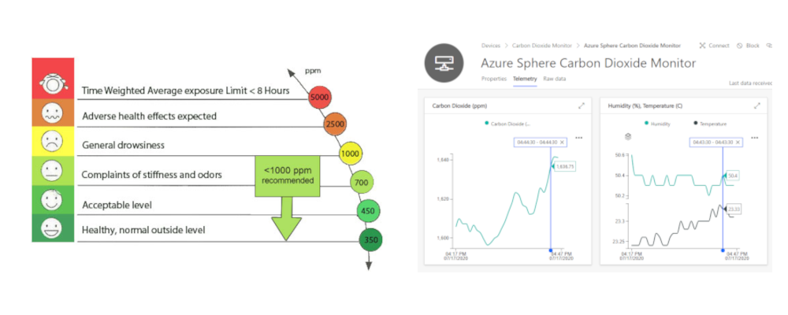
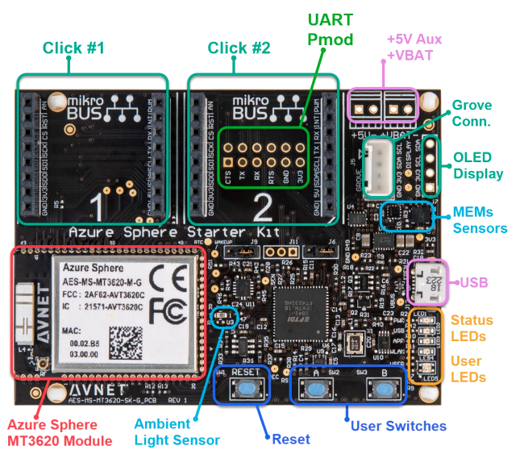

# Improve health, wellbeing, and productivity by tracking CO2 levels

How to create a healthier living and working environment by monitoring CO2, temperature, and humidity levels with [Azure Sphere](https://azure.microsoft.com/en-gb/services/azure-sphere/?WT.mc_id=julyot-co2-dglover), and [Azure IoT Central](https://azure.microsoft.com/en-gb/services/iot-central/?WT.mc_id=julyot-co2-dglover).



---

## Contents

| Folder | Description |
|-------------|-------------|
| `src`       | Azure Sphere CO2 monitor code |
| `README.md` | This README file. |
| `LICENSE.txt`   | The license for the project. |

### Project expectations

The code demonstrates how to create an Azure Sphere CO2 monitor and integrate it with IoT Central. It is not official, maintained, or production-ready code.

### Expected support for the code

This code is not formally maintained, but we will do our best to respond and address issues you encounter.

### How to report an issue

If you run into an issue with this code, please open a GitHub issue against this repo.

## Contributing

This project welcomes contributions and suggestions. Most contributions require you to agree to a Contributor License Agreement (CLA) declaring that you have the right to, and actually do, grant us the rights to use your contribution. For details, visit https://cla.microsoft.com.

When you submit a pull request, a CLA-bot will automatically determine whether you need to provide a CLA and decorate the PR appropriately (e.g., label, comment). Simply follow the instructions provided by the bot. You will only need to do this once across all repositories using our CLA.

This project has adopted the [Microsoft Open Source Code of Conduct](https://opensource.microsoft.com/codeofconduct/).
For more information see the [Code of Conduct FAQ](https://opensource.microsoft.com/codeofconduct/faq/) or contact [opencode@microsoft.com](mailto:opencode@microsoft.com) with any additional questions or comments.

---

## Learning resources

1. [Azure Sphere Documentation](https://docs.microsoft.com/azure-sphere/)
1. [Develop secure IoT Solutions for Azure Sphere with IoT Hub](https://docs.microsoft.com/learn/modules/develop-secure-iot-solutions-azure-sphere-iot-hub/)
1. [Develop secure IoT solutions for Azure Sphere, Azure RTOS, and Azure IoT Central](https://docs.microsoft.com/learn/modules/develop-secure-iot-solutions-azure-sphere-iot-central/)

---

## Are CO2 levels making you grumpy, sleepy, or sad

When working from home, it's easy to close the door to shut out the noise of everyday life while we get on with work. Closing the door can lead to a build-up of CO2 gas, a by-product of our breathing. High CO2 levels can impact our wellbeing, concentration, and productivity levels.

Check out "[Indoor carbon dioxide levels could be a health hazard, scientists warn](https://www.theguardian.com/environment/2019/jul/08/indoor-carbon-dioxide-levels-could-be-a-health-hazard-scientists-warn)".

The problem is we cannot see or smell Carbon Dioxide, it keeps building up, and we have no way of knowing it's happening other than getting tired or a headache. So, with that in mind, I figured it was the Internet of Things to the rescue!

---

## Solution requirements

These are the solution requirements:

1. Chart CO2 levels, along with temperature, pressure, and humidity.
1. Provide an audible and visual alert for high CO2 levels.
1. Set CO2 alert levels for a given device.
1. Control when OS and application updates are applied.
1. Automatic restart if the application fails.
1. Access to central error reports for all the devices.
1. IoT Plug and Play support for IoT Central.

## What you will learn from implementing the CO2 monitoring solution

The goal of the solution is also to demonstrate best practices for Azure Sphere solutions. You will learn how to do the following:

1. Set up Azure Sphere security.
1. Publish telemetry to IoT Central.
1. Update "device to cloud" properties for point in time reporting in IoT Central.
1. Update IoT Central "cloud to device" properties to set CO2 "Buzzer" alert levels.
1. Validate sensor and cloud data.
1. Implement a button to mute the CO2 alert buzzer.
1. Production considerations.
    1. Implement deferred updates for application and system updates.
    1. Watchdog support. Auto-restart the CO2 monitor if the application fails.
    1. Report device start date and time, plus software version information.
    1. [Download device error reports](https://docs.microsoft.com/azure-sphere/deployment/interpret-error-data).
1. Enable IoT Plug and Play.

> IoT Central is a cloud-based IoT solution built on Azure IoT Hub. IoT Central properties use IoT Hub Device Twins. IoT Central commands use IoT Hub direct methods.

---

## Azure IoT Central

[Azure IoT Central](https://azure.microsoft.com/en-in/services/iot-central/?WT.mc_id=julyot-co2-dglover) provides an easy way to connect, monitor, and manage your Internet of Things (IoT) assets at scale. There is a free trial for IoT Central, and you can continue to connect two devices to IoT Central for free after the trial period expires.


---

## Azure Sphere

Azure Sphere is a general-purpose IoT platform that is secure by design and by default. You focus on your IoT application, and Azure Sphere looks after ongoing platform security.

Azure Sphere consists of the following components:

* **Azure Sphere–certified chips** from hardware partners include built-in Microsoft security technology to provide connectivity and a dependable hardware root of trust.
* **Azure Sphere OS** adds layers of protection and ongoing security updates to create a trustworthy platform for new IoT experiences.
* **Azure Sphere Security Service** brokers trust for device-to-cloud communication, detects threats and renews device security.

Together these components implement [The Seven Properties of Highly Secure Devices](https://www.microsoft.com/research/publication/seven-properties-highly-secure-devices?azure-portal=true).


---

## Azure Sphere DevX

The CO2 monitoring project uses the community-maintained Azure Sphere DevX library. The focus of the Azure Sphere DevX library is communications and simplification of common scenarios. The library is modular, lightweight, and well tested. The Azure Sphere DevX library will help reduce the amount of code you write and improve readability and long-term application maintenance.

For more information, refer to the [Azure Sphere DevX Wiki](https://github.com/Azure-Sphere-DevX/AzureSphereDevX.Examples/wiki).

---

## Supported hardware configurations

The CO2 monitor project supports the following hardware configurations.

### Avnet Azure Sphere with Click and Grove peripherals

1. [Avnet Azure Sphere Starter Kit Rev 1 or Rev 2](https://www.avnet.com/shop/us/products/avnet-engineering-services/aes-ms-mt3620-sk-g-3074457345636825680/)
1. [Seeed Studio Grove CO2 & Temperature & Humidity Sensor](https://www.seeedstudio.com/Grove-CO2-Temperature-Humidity-Sensor-SCD30-p-2911.html)
1. [MikroE BUZZ Click](https://www.mikroe.com/buzz-click)

#### Set up

1. Insert the MikroE BUZZ Click into socket 1 of the Avnet Azure Sphere starter kit.
1. Plug the Seeed Studio Grove CO2 & Temperature & Humidity Sensor into Grove Socket on the Avnet Starter Kit.


### Avnet Azure Sphere with Click peripherals

1. [Avnet Azure Sphere Starter Kit Rev 1 or Rev 2](https://www.avnet.com/shop/us/products/avnet-engineering-services/aes-ms-mt3620-sk-g-3074457345636825680/)
1. [MikroE HVAC Click](https://www.mikroe.com/hvac-click)
1. [MikroE BUZZ Click](https://www.mikroe.com/buzz-click)

#### Set up

1. Insert the MikroE BUZZ Click into socket 1 of the Avnet Azure Sphere starter kit.
1. Insert the MikroE HVAC Click into socket 2 of the Avnet Azure Sphere starter kit.


---

## Device drivers

Device drivers can be daunting to start with, but most silicon vendors drivers have a hardware abstraction layer (HAL) where you implement platform-specific support for the driver.

### MikroE BUZZ Click


The BUZZ Click piezo speaker alerts you when recorded CO2 levels are above the CO2 alert level.

The BUZZ Click is a Pulse Width Module (PWM) peripheral. You control the tone by changing the PWM frequency and the volume by altering the PWM duty cycle. The piezo speaker is driven at a frequency of 5kHz, with a 1% duty cycle, for ten milliseconds. This combination produces a pip sound, enough to alert you without being too annoying.

This oscilloscope screenshot shows the PWM signal generated to drive the piezo speaker.


### The Sensirion SDC30 CO2 Sensor


Sensirion, the company that manufactures the SCD30 CO2 sensor in the [Seeed Studio Grove CO2 & Temperature & Humidity Sensor](https://www.seeedstudio.com/Grove-CO2-Temperature-Humidity-Sensor-SCD30-p-2911.html) makes it easy to port their drivers to different platforms, including Azure Sphere.

It was a matter of implementing the I2C init/read/write functions and a microsecond sleep function. The CO2 monitor project includes the ported driver. You can view the driver here [sensirion_hw_i2c_implementation.c](src/embedded-scd/embedded-common/hw_i2c/sensirion_hw_i2c_implementation.c)

#### Calibrating the SCD30 sensor

**IMPORTANT**. Be sure to read calibrating the [Grove - CO2 & Temperature & Humidity Sensor (SCD30) Calibration](https://wiki.seeedstudio.com/Grove-CO2_Temperature_Humidity_Sensor-SCD30/#calibration) sensor. This solution enables auto-calibration of the sensor.

When scd30 automatic self-calibration (ASC) is activated for the first time, the sensor must remain powered on for at least 7 days. The calibration process restarts if the sensor is powered off during these 7 days. This time is needed for the sensor algorithm to calculate its initial parameter set for ASC. The sensor must be exposed to fresh air for at least 1 hour every day.

### The Sensirion SDC41 CO2 Sensor

The MikroE HVAC Click uses the Sensirion SDC41 CO2, Temperature, and humidity sensor. Sensirion, follow the same pattern for the [SDC41 driver](https://github.com/Sensirion/embedded-i2c-scd4x) as the SDC30 sensor, there is a HAL, and it's a matter of implementing Azure Sphere I2C support. Calibration of the sensor is also required.


### Avnet Azure Sphere onboard sensors



The Avnet Azure Sphere starter kit has several onboard sensors, including temperature, pressure, light, and an accelerometer. This solution uses the onboard air pressure and the light sensor.

So, with the CO2 sensor from Sensirion and the Avnet onboard sensors, there are sensors for carbon dioxide, temperature, humidity, pressure, and light.

Drivers for the STM sensors on the Avnet starter kit follow the same pattern as drivers from Sensirion. You need to implement I2C platform_read, platform_write, platform_init, and platform_delay. To review the driver implementation, refer to [imu_temp_pressure.c](src/AzureSphereDrivers/AVNET/HL/imu_temp_pressure.c)

### Light sensor

The solution uses the onboard light sensor. The light sensor is an analog device, and it's read with the Azure Sphere ADC (Analog-to-digital Converter) APIs.

### Driving the LEDs

The easiest way to control LEDs is to treat them as GPIO peripherals. But to be a little bit fancy, the LEDs in the CO2 project are driven using PWM to control their brightness. The ambient light level determines the brightness of the status LED.

---

## Set up your developer tools and your Azure Sphere

Perform the following steps to set up the developer tools and your Azure Sphere.

1. Install Visual Studio Code.
1. Install the Visual Studio Code Azure Sphere extension.
1. Install the Azure Sphere SDK.
1. Claim your Azure Sphere device.
1. Configure the Azure Sphere Wi-Fi network.
1. Update the Azure Sphere OS.
1. Enable app development for your device.

Follow the [Quickstarts to set up your Azure Sphere device](https://docs.microsoft.com/azure-sphere/install/overview).

---

## Azure IoT Central

[Azure IoT Central](https://azure.microsoft.com/en-in/services/iot-central/?WT.mc_id=julyot-co2-dglover) provides an easy way to connect, monitor, and manage your IoT assets at scale.

Your Azure Sphere device can securely connect and communicate with cloud services. Azure Sphere includes built-in library support for Azure IoT Hub and Azure IoT Central. This walk-through uses Azure IoT Central because it's a fast way to demonstrate the value of IoT.  Take a moment to read [Your IoT journey: simplified and secure with Azure IoT Central and Azure Sphere](https://techcommunity.microsoft.com/t5/internet-of-things/your-iot-journey-simplified-and-secure-with-azure-iot-central/ba-p/1404247?WT.mc_id=julyot-co2-dglover).


---

## IoT Plug and Play

This solution uses IoT Plug and Play with IoT Central. IoT Plug and Play (PnP) defines a model that a device uses to advertise its capabilities to a PnP-enabled application like IoT Central. PnP is an open specification, to learn more, refer to [What is IoT Plug and Play](https://docs.microsoft.com/azure/iot-pnp/overview-iot-plug-and-play).

An IoT Plug and Play CO2 monitor model has been published to the [public repository of IoT Plug and Play](https://github.com/Azure/iot-plugandplay-models) models. When your device first connects to IoT Central, the IoT Plug and Play model will be retrieved from the public repository of models. IoT Central will then create default views using the Plug and Play model.

The PnP model for the CO2 monitor solution is in the iot_plug_and_play directory. This model has been uploaded to the public repository of [IoT Plug and Play models](https://github.com/Azure/iot-plugandplay-models/tree/main/dtmi/com/example/azuresphere)

The IoT Plug and Play model the CO2 monitor uses is declared in main.h.

```c
#define IOT_PLUG_AND_PLAY_MODEL_ID "dtmi:com:example:azuresphere:co2monitor;1"
```

---

## Create a new Azure IoT Central application

1. Open the IoT Central web portal by selecting this link [Azure IoT Central](https://azure.microsoft.com/services/iot-central?azure-portal=true).

1. Select **Build a solution**.

1. You'll need to sign with your Microsoft personal, work, or school account. If you don't have a Microsoft account, then you can create one for free by using the **Create one!** link.

1. Expand the sidebar menu by selecting the **Menu** icon.

    

1. Navigate to **Build**, select **Custom app**, then select **Create app**.

    

1. Specify the **Application name** and **URL**.

1. Select the pricing plan, for now, select **Free**, you can migrate to a standard plan with 2 free devices after 7 days.

1. Select **Create**.

---

## IoT Central and Azure Sphere tenant trust

Once your IoT Central application has been created, you must enable trust between your Azure Sphere tenant and your Azure IoT Central application. Trust is enabled by sharing your Azure Sphere tenant Certificate Authority certificate with your IoT Central application.

When trust is enabled, any device claimed into your trusted Azure Sphere tenant will be enrolled when it first connects to IoT Central.

Follow these steps to enable trust.

1. Open a **command prompt**.

2. Log in to your Azure Sphere tenant. From the command prompt, run:

   ```azsphere
   azsphere login
   ```

3. Make a note of the current folder. You'll need the name of this folder in the next step.

4. Download the Azure Sphere tenant certificate authority (CA) certificate. From the command prompt, run:

   ```azsphere
   azsphere ca-certificate download --destination CAcertificate.cer
   ```

### Create an Enrollment Group

1. From the IoT Central web portal, select the hamburger button on the top-left corner of the screen to expand the sidebar menu.

1. Select **Administration**, then **Device Connection**.

1. Select **+ New**.

1. Name the enrollment group **Azure Sphere**.
1. Leave group type set to **IoT devices**.
1. Select Certificates (X.509) from the Attestation type dropdown.
1. Select **Save**.

### Upload the Azure Sphere tenant CA certificate to Azure IoT Central

1. Select **+ Manage primary**.

1. Select the folder icon next to the **Primary** box and navigate to the folder where you downloaded the certificate. If you don't see the .cer file in the list, ensure the view filter is set to **All files (*)**. Select the certificate and then select the gear icon next to the **Primary** box.

1. The **Primary Certificate** dialog box appears. The **Subject** and **Thumbprint** fields contain information about the current Azure Sphere tenant and primary root certificate.

### Verify the tenant CA certificate

1. Select the **Generate verification code**.
1. Copy the verification code to the clipboard.

    

1. Download a validation certificate that proves you own the Azure Sphere tenant CA certificate. Replace **<code\>** in the command with the verification code you copied to the clipboard. From a command prompt, run:

   ```azsphere
   azsphere ca-certificate download-proof --destination ValidationCertification.cer --verification-code <code>
   ```

    The Azure Sphere Security Service signs the validation certificate with the verification code to prove that you own the Certificate Authority (CA).

<!-- ### Verify the tenant's identity -->

1. Return to Azure IoT Central and select **Verify**.

1. When prompted, select the validation certificate that you generated in the previous step. When the verification process is complete, the **Primary Certificate** dialog box displays the **Verified** message.

1. Select **Close** to dismiss the box.
1. Select **Save**.

    

---

## List your IoT Central network endpoints

Azure Sphere applications are secure by default, including hardware and network endpoints. You must declare your IoT Central network endpoints, otherwise, your Azure Sphere application will not be able to connect to IoT Central.

Follow these steps to list the network endpoints of your IoT Central application.

1. Open a command prompt.
1. Clone the Azure Sphere samples as you will need the **ShowIoTCentralConfig** tool.

    ```
    git clone https://github.com/Azure/azure-sphere-samples.git
    ```

1. Navigate to the **azure-sphere-samples** folder.

   - On Windows, navigate to the **Samples\AzureIoT\Tools\win-x64** folder.
   - On Linux, navigate to the **Samples/AzureIoT/Tools/linux-x64** folder. On Linux, you may need to explicitly set execution permissions for the **ShowIoTCentralConfig** tool. From a terminal, run `chmod +x ShowIoTCentralConfig` to add execution permissions for the tool.

1. When you run the **ShowIoTCentralConfig** tool, you'll be prompted for the following information:

   | Prompt                                                 | Response                                                         |
   | ------------------------------------------------------------ | ------------------------------------------------------------ |
   | **Are you using a legacy (2018) IoT Central application (Y/N)** | Respond **N**.                                                |
   | **IoT Central App URL**                                      | The IoT Central URL can be found in your browser address bar. For example, https://apps.azureiotcentral.com |
   | **API token**                                                | The API token can be generated from your Azure IoT Central application. In the Azure IoT Central application, select **Administration**, select **API Tokens**, select **Generate Token**, provide a name for the token (for example, "AzureSphere"), select **Administrator** as the role, and select **Generate**. Copy the token to the clipboard. The token starts with **SharedAccessSignature**. |
   | **ID Scope**                                                 | In the Azure IoT Central application, select **Administration** > **Device Connection** and then copy the **ID Scope**. |

1. Run the **ShowIoTCentralConfig** tool and follow the prompts.

   > Note, your organization might require consent for the **ShowIoTCentralConfig** tool to access your Azure IoT Central data in the same way that the Azure API requires such consent.

1. Review the output from the **ShowIoTCentralConfig** tool. It will look similar to the following text.

   ```json
   "CmdArgs": [ "--ScopeID", "0ne0099999D" ],
   "Capabilities": {
      "AllowedConnections": [ "global.azure-devices-provisioning.net", "iotc-9999bc-3305-99ba-885e-6573fc4cf701.azure-devices.net", "iotc-789999fa-8306-4994-b70a-399c46501044.azure-devices.net", "iotc-7a099966-a8c1-4f33-b803-bf29998713787.azure-devices.net", "iotc-97299997-05ab-4988-8142-e299995acdb7.azure-devices.net", "iotc-d099995-7fec-460c-b717-e99999bf4551.azure-devices.net", "iotc-789999dd-3bf5-49d7-9e12-f6999991df8c.azure-devices.net", "iotc-29999917-7344-49e4-9344-5e0cc9999d9b.azure-devices.net", "iotc-99999e59-df2a-41d8-bacd-ebb9999143ab.azure-devices.net", "iotc-c0a9999b-d256-4aaf-aa06-e90e999902b3.azure-devices.net", "iotc-f9199991-ceb1-4f38-9f1c-13199992570e.azure-devices.net" ],
      "DeviceAuthentication": "--- YOUR AZURE SPHERE TENANT ID---",
   }
   ```

1. Copy the output from the **ShowIoTCentralConfig** tool to Notepad, as you'll need this information soon.


## Clone the CO2 monitor healthy spaces repo

The CO2 healthy spaces solution is part of the [Azure Sphere Gallery](https://github.com/Azure/azure-sphere-gallery). Clone the Azure Sphere Gallery repository to your computer.

From a command prompt, run the following command.

```powershell
git clone --recurse-submodules https://github.com/Azure/azure-sphere-gallery.git
```

---

## Open the lab project

1. Start Visual Studio Code
1. From the main menu, select **File**, then select **Open Folder...**.
1. Open the **azure-sphere-gallery/CO2_MonitorHealthySpaces/src** project folder.
1. Click **Select Folder** or the **OK** button to open the project.

---

## The CO2 monitor project structure

There're five files in the project you need to understand.

1. app_manifest.json: Used for network configuration and security settings.
1. azsphere_board.txt: Used to select your Azure Sphere developer board.
1. main.c: The main code/logic for the application.
1. main.h: All the declarations for the application.

Take a moment to familiarize yourself with these files.


---

## Select your Avnet starter board

The default board is the Avnet Starter Kit Rev 1. If this is the board you're using, then skip to the next step.

If you have an Avnet Starter Kit Rev 2 board, then follow these instructions.

1. In Visual Studio Code, open the **azsphere_board.txt** file.
1. Comment out the Avnet Rev 1 board with a **#**.
1. Uncomment the Avnet Rev 2 board by removing the leading **#** character.
1. Save the changes.
1. Rebuild the CMake cache. Press <kbd>Ctrl+Shift+P</kbd> to open the Visual Studio Code command palette. Type **cmake: configure**, and select the CMake:configure option to rebuild the CMake cache.

---

## Configure the project for IoT Central

1. In Visual Studio Code, open the **app_manifest.json** file.
1. Update **CmdArgs** with your Azure IoT Central **ID Scope**.
1. Update **DeviceAuthentication** with your **Azure Sphere Tenant ID**. From a **command prompt**, run the following command.

    ```
    azsphere tenant show-selected
    ```

    The output of this command will look similar to the following.

    ```text
    ------------------------------------ ------------------- -------------
    Id                                   Name                Roles
    ======================================================================
    9abc79eb-9999-43ce-9999-fa8888888894 myAzureSphereTenant Administrator
    ------------------------------------ ------------------- -------------
    ```

1. Update the network endpoints **AllowedConnections** with the Azure IoT Central Application endpoint URLs you copied to Notepad.
1. **Review** your updated manifest_app.json file. It should look similar to the following.

    ```json
    {
      "SchemaVersion": 1,
      "Name": "hvac_solution",
      "ComponentId": "25025d2c-66da-4448-bae1-ac26fcdd3627",
      "EntryPoint": "/bin/app",
      "CmdArgs": [ "--ScopeID", "0ne0099999D" ],
      "Capabilities": {
        "SystemEventNotifications": true,
        "SoftwareUpdateDeferral": true,
        "Gpio": [ "$AZURE_CONNECTED_LED", "$BUTTON_B" ],
        "Pwm": [ "$PWM_CLICK_CONTROLLER", "$PWM_RGB_CONTROLLER" ],
        "I2cMaster": [ "$I2C_ISU2" ],
        "Adc": [ "$AVNET_MT3620_SK_ADC_CONTROLLER0" ],
        "AllowedConnections": [
            "global.azure-devices-provisioning.net",
            "iotc-9999bc-3305-99ba-885e-6573fc4cf701.azure-devices.net",
            "iotc-789999fa-8306-4994-b70a-399c46501044.azure-devices.net",
            "iotc-7a099966-a8c1-4f33-b803-bf29998713787.azure-devices.net",
            "iotc-97299997-05ab-4988-8142-e299995acdb7.azure-devices.net",
            "iotc-d099995-7fec-460c-b717-e99999bf4551.azure-devices.net",
            "iotc-789999dd-3bf5-49d7-9e12-f6999991df8c.azure-devices.net",
            "iotc-29999917-7344-49e4-9344-5e0cc9999d9b.azure-devices.net",
            "iotc-99999e59-df2a-41d8-bacd-ebb9999143ab.azure-devices.net",
            "iotc-c0a9999b-d256-4aaf-aa06-e90e999902b3.azure-devices.net",
            "iotc-f9199991-ceb1-4f38-9f1c-13199992570e.azure-devices.net"
        ],
        "DeviceAuthentication": "9abc79eb-9999-43ce-9999-fa8888888894"
      },
      "ApplicationType": "Default"
    }
    ```

---

## Deploying the CO2 monitor application to Azure Sphere

Start the app build deploy process.

1. Select **CMake: [Debug]: Ready** from the Visual Studio Code Status Bar.

    

1. From Visual Studio Code, press <kbd>F5</kbd> to build, deploy, and attached the debugger to the CO2 monitor application now running the Azure Sphere device.

### View debugger output

1. Open the Visual Studio Code **Output** tab to view the output from **Log_Debug** statements in the code.

    > Pro Tip. You can open the output window by using the Visual Studio Code <kbd>Ctrl+K Ctrl+H</kbd> shortcut or click the **Output** tab.

1. You will see the device negotiating security, and then it will start sending telemetry to Azure IoT Central.

---

## Expected device behavior


1. The yellow App LED will blink rapidly when the application starts.
1. The App LED will blink on and off while the device connects to IoT Central.
1. When connected to IoT Central, the App LED will flash briefly every 4 seconds.
1. The User LED will most likely turn blue to indicate the current CO2 level is below the CO2 alert level.
1. The User LED will turn red if the recorded CO2 level is higher than the CO2 alert level.
1. The BUZZ click will emit a high-pitched sound if the current CO2 level is greater than the CO2 alert level. You can press button B to mute the buzzer.

---

## View your device on the IoT Central Dashboard

1. Switch back to Azure IoT Central in your web browser.
1. Select **Devices** from the IoT Central sidebar menu.
1. Select the **CO2 Monitor** template.
1. When your device is enrolls into IoT Central, you may be prompted to **Refresh** the device list.
1. Select your device, the device details page will open to display the device telemetry.
1. Navigate the **About**, **Overview**, and **Raw data** tabs to familiarize yourself with IoT Central device view.

    

## Create a Settings View

Create an IoT Central Settings View to set the CO2 alert level for the CO2 monitor.

1. From the device view page, select **Manage template**, then select **Edit template**.
1. Select **Views**.
    
1. Select **Editing device and cloud data**.
1. Name the form **Settings**.
1. Expand the **Properties**.
1. Select **CO2 alert level (ppm)**.
1. Select **Add section**.
1. Select **Save**.
1. Select **Back**.
1. Select **Publish**.


---

## Setting the CO2 alert level

Navigate back to the IoT Central device view.

1. Select **Devices** from the IoT Central sidebar menu.
1. Select the **CO2 Monitor** template.
1. Select your device, the device details page will open to display the device telemetry.
1. Select the **Settings** tab.
1. Set the CO2 alert level to 400 ppm, and select **Save**. This low value should trigger the CO2 alert buzzer.
1. Set the CO2 alert level to a more realistic value like 800 pmm, and select **Save**.

You can test CO2 alert levels by breathing onto the CO2 sensor.

---

## Extend and integrate Azure IoT Central applications with other cloud services

Azure IoT Central is also extensible using rules and workflows. For more information, review [Use workflows to integrate your Azure IoT Central application with other cloud services](https://docs.microsoft.com/en-us/azure/iot-central/core/howto-configure-rules-advanced?WT.mc_id=julyot-co2-dglover)

---

## Application notes

### Deferred update

Azure Sphere supports deferred updates. Deferred updates are an important production consideration as you will likely want to control when application and OS updates are applied to your Azure Sphere.

The criteria you use to determine the best time to apply updates will be application-specific. For example, it might make sense to apply updates in the early hours of the morning.

The deferred update example included in the CO2 monitor project is a simple time of day calculation. **DeferredUpdateCalculate**  is called when an application or OS update is pending.

The CO2 monitor calculates the local time using UTC (Universal Time Coordinate) plus the local time zone offset. If the calculated local time is between 1 am and 5 am then a zero-minute deferral is requested, and updates are applied. Failing that, a 15-minute deferral extension is requested.

You can't defer updates forever. For an OS update, the maximum deferral is 1440 minutes (24 hours). For an application update, the maximum deferral period is 10,020 minutes (167 hours). To learn more about deferred updates, refer to [Defer device updates](https://docs.microsoft.com/azure-sphere/app-development/device-update-deferral).

The following deferred update code is located in main.c of the CO2 monitor project.

```c
/// <summary>
/// Algorithm to determine if a deferred update can proceed
/// </summary>
/// <param name="max_deferral_time_in_minutes">The maximum number of minutes you can defer</param>
/// <returns>Return 0 to start update, return greater than zero to defer</returns>
static uint32_t DeferredUpdateCalculate(uint32_t max_deferral_time_in_minutes, SysEvent_UpdateType type, SysEvent_Status status,
                                        const char *typeDescription, const char *statusDescription)
{
    // UTC +10 is good for Australia.
    // Update time_zone_offset to your time zone offset.
    const int time_zone_offset = 10;

    //  Get UTC time
    time_t now = time(NULL);
    struct tm *t = gmtime(&now);

    // Calculate UTC plus offset and normalize.
    t->tm_hour += time_zone_offset;
    t->tm_hour = t->tm_hour % 24;

    // If local time between 1am and 5am defer for zero minutes else defer for 15 minutes
    uint32_t requested_minutes = IN_RANGE(t->tm_hour, 1, 5) ? 0 : 15;

    char utc[40];

    // Update defer requested device twin
    snprintf(msgBuffer, sizeof(msgBuffer), "Utc: %s, Type: %s, Status: %s, Max defer minutes: %i, Requested minutes: %i",
             dx_getCurrentUtc(utc, sizeof(utc)), typeDescription, statusDescription, max_deferral_time_in_minutes, requested_minutes);

    dx_deviceTwinReportValue(&dt_defer_requested, msgBuffer);

    return requested_minutes;
}
```

---

## Set your time zone

1. **Open** the CO2 Monitor project in Visual Studio Code.
1. Locate the **DeferredUpdateCalculate** function in **main.c**.
1. **Update** the DeferredUpdateCalculate function with your time zone offset. The default time zone offset is 10 (Australia/Sydney AEST).

    ```c
    // UTC +10 is for Australia/Sydney.
    // Set the time_zone_offset to your time zone offset.
    const int time_zone_offset = 10;
    ```

1. Review the deferred update time calculation. Deferred updates will be applied between 1 am and 5 am.

    ```c
    // If local time is between 1 am and 5 am defer for zero minutes else defer for 15 minutes
    uint32_t requested_minutes = IN_RANGE(t->tm_hour, 1, 5) ? 0 : 15;
    ```

1. Select **CMake: [Release]: Ready** from the Visual Studio Code Status Bar.

    

1. Select **Build** from the Visual Studio Code Status Bar to build the project in release mode.

---

## Enable deferred updates

1. Delete the existing CO2 monitor application on your Azure Sphere. From the command prompt, run:

    ```powershell
    azsphere device sideload delete
    ```

1. Restart your device. From the command prompt, run:

    ```powershell
    azsphere device restart
    ```

1. Create an Azure Sphere Product. From the command prompt, run:

    ```powershell
    azsphere product create --name CO2Monitor
    ```

1. Move your device to the Field Test group. From the command prompt, run:

    ```powershell
    azsphere device update --device-group "CO2Monitor/Field Test"
    ```

1. From a command prompt, navigate to the **azure-sphere-gallery/CO2_MonitorHealthySpaces/src/out/ARM-Release** folder.
1. Upload the imagepackage to your Azure Sphere tenant. From the command prompt, run:

    ```powershell
    azsphere image add --image co2monitor.imagepackage
    ```

    The output of the image add command will be similar to the following.

    ```text
    Uploading image from file 'co2monitor.imagepackage':
     --> Image ID:       3962c015-8f52-4d85-a043-acbc38f8b4aa
     --> Component ID:   25025d2c-66da-4448-bae1-ac26fcdd3627
     --> Component name: 'co2monitor'
    Removing temporary state for uploaded image.
    Successfully uploaded image with ID '3962c015-8f52-4d85-a043-acbc38f8b4aa' and name 'co2monitor' to component with ID '25025d2c-66da-4448-bae1-ac26fcdd3627'.
    ```

1. Make a note of the Image ID returned from the image add command as you will need it for the next command.
1. Create a new deployment for a device group for the uploaded co2monitor image.
    The following example uses the image ID returned from the previous command for illustrative purposes. Be sure to **your image ID** when you running the following command.

    ```powershell
    azsphere device-group deployment create --device-group "CO2Monitor/Field Test" --images 3962c015-8f52-4d85-a043-acbc38f8b4aa
    ```

1. Enable your device for cloud testing. From the command prompt, run:

    ```powershell
    azsphere device enable-cloud-test
    ```

It will take approximately 30 seconds for the application to be deployed to your Azure Sphere.

> Note, when you enable your device for cloud testing, you'll not be able to deploy an application to your device from Visual Studio Code. Later, you can reenable local development by running the ```azsphere device enable-development``` command.

---

## Deploy an application update

Next, deploy an update that will be deferred.

1. Ensure the CO2 Monitor solution is open in Visual Studio Code.
1. Open the **main.h** file.
1. Locate the **#define CO2_MONITOR_FIRMWARE_VERSION "3.02"** statement.
1. Update the version number to **3.03**.

    ```c
    #define CO2_MONITOR_FIRMWARE_VERSION "3.03"
    ```

1. Select **Build**  from the Visual Studio Code Status Bar to build the project in release mode.
1. From a command prompt, navigate to the **azure-sphere-gallery/CO2_MonitorHealthySpaces/src/out/ARM-Release** folder.
1. Upload the imagepackage to your Azure Sphere tenant. From the command prompt, run:

    ```powershell
    azsphere image add --image co2monitor.imagepackage
    ```

1. Create a new deployment for a device group for the uploaded co2monitor image. From the command prompt, run:

    ```powershell
    azsphere device-group deployment create --device-group "CO2Monitor/Field Test" --images <the_image_id>
    ```

### Monitor the deferred update status

The IoT Central **Deferred update status** property is updated every time **DeferredUpdateCalculate** is called. You can view the deferred update status and deployed software version from the IoT Central device **About** tab. Select the **expand** icon to expand the page view.

> Note, there may be no status updates for hours. If you get impatient, press the reset button on the Avnet Azure Sphere board. When the device restarts, deferred updates will be applied.


### Application deployment status

The following are useful commands when enabling over-the-air application deployments. Note, the Azure Sphere must be USB connected to your computer for these commands to work.

The list-targeted command will display what image package is to be deployed to your device.

```powershell
azsphere device image list-targeted
```

The list-installed command will display what image package has been deployed to your device.

```powershell
azsphere device image list-installed
```

### Application watchdog

Azure Sphere supports application-level watchdogs. The CO2 monitor application includes a watchdog timer. The timer's role is to keep extending the watchdog period.

The watchdog period is set to 60 seconds. If the application fails to extend the watchdog period within 60 seconds, the Azure Sphere OS assumes the application has failed and restarts the application.

Application restarts are recorded in the Azure Sphere tenant error logs. You can view the error report by running the following command from a command prompt.

```powershell
azsphere tenant download-error-report
```

The following code in **main.c** is the watchdog timer callback implementation that extends the watchdog by 60 seconds.

```c
/// <summary>
/// This timer extends the app level lease watchdog
/// </summary>
/// <param name="eventLoopTimer"></param>
static void watchdog_handler(EventLoopTimer *eventLoopTimer)
{
    if (ConsumeEventLoopTimerEvent(eventLoopTimer) != 0)
    {
        dx_terminate(DX_ExitCode_ConsumeEventLoopTimeEvent);
        return;
    }
    timer_settime(watchdogTimer, 0, &watchdogInterval, NULL);
}
```

The application watchdog is disabled by default. If you are debugging the CO2 monitor and pause execution for longer than 60 seconds the Azure Sphere OS thinks the application has failed and will restart it. To enable the watchdog for production, uncomment the call to **start_watchdog** in the **InitPeripheralsAndHandlers** function.

```c
static void InitPeripheralsAndHandlers(void)
{
    ...
    // Uncomment for production
    // start_watchdog();
}
```

## This project is evergreen

This project automatically updates the CMake Azure Sphere configuration to match the Azure Sphere SDK you've installed on your computer. This is fine for a sample, but for production applications, setting the Azure Sphere configuration in CMake should be intentional and tested.

In the CMakeLists.txt file, the *auto_generate_azsphere_config* CMake function is called to generate the azsphere_configure_tools and azsphere_configure_api settings.

```makefile
if (EXISTS "${CMAKE_SOURCE_DIR}/Tools/cmake/azsphere_config.cmake")

    include(Tools/cmake/azsphere_config.cmake)
    auto_generate_azsphere_config()

else()

    # For information on setting tools revision and target api set see
    # https://docs.microsoft.com/en-us/azure-sphere/app-development/using-cmake-functions

    azsphere_configure_tools(TOOLS_REVISION "21.07")
    azsphere_configure_api(TARGET_API_SET "10")

endif()
```

For production applications, remove this block and replace it with the following CMake commands.

```makefile
    azsphere_configure_tools(TOOLS_REVISION "<YOUR_TOOLS_VERSION>")
    azsphere_configure_api(TARGET_API_SET "<THE_TARGET_API_SET_YOU_ARE_TESTING_AGAINST")
```

---

## License

See [LICENSE.txt](./LICENSE.txt)

* The AzureSphereDevX repository is included via a submodule. The license for AzureSphereDevX can be [found here](https://github.com/Azure-Sphere-DevX/AzureSphereDevX/blob/master/LICENSE).
* The AzureSphereDevX.HardwareDefinitions repository is included via a submodule. The license for AzureSphereDevX.HardwareDefinitions can be [found here](https://github.com/Azure-Sphere-DevX/AzureSphereDevX.HardwareDefinitions/blob/main/LICENSE).
* The AzureSphereDevX.Tools repository is included via a submodule. The license for AzureSphereDevX.Tools can be [found here](https://github.com/Azure-Sphere-DevX/AzureSphereDevX.Tools/blob/main/LICENSE).
* The AzureSphereDrivers repository is included via a submodule. The license for AzureSphereDrivers can be [found here](https://github.com/Azure-Sphere-DevX/AzureSphereDrivers/blob/master/LICENSE).
