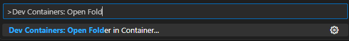
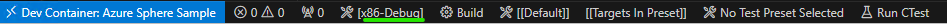
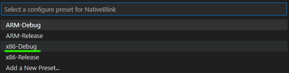
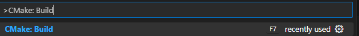
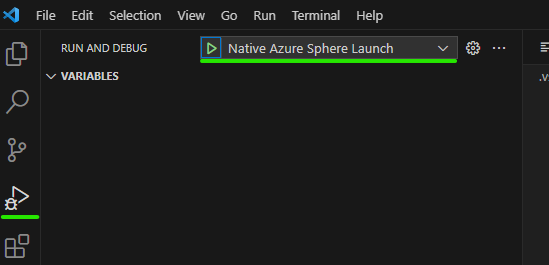
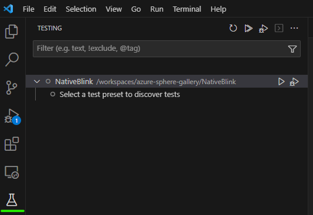
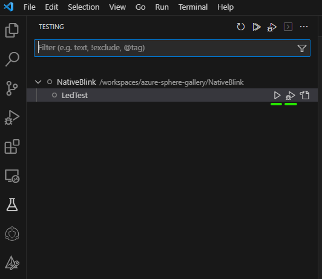

# Native Blink

This sample is an adaptation of the [HelloWorld_HighLevelApp](https://github.com/Azure/azure-sphere-samples/tree/main/Samples/HelloWorld/HelloWorld_HighLevelApp) sample, with the added ability to build and debug for native Linux.

## Contents

| File/folder                | Description |
|----------------------------|-------------|
| `.devcontainer`            | Folder containing the configuration of the Dev Container to use when opening the sample remotely. |
| `.vscode`                  | Folder containing the JSON files that configure Visual Studio Code for deploying and debugging the application. |
| `HardwareDefinitions`      | Folder containing the hardware definition files for various Azure Sphere boards. |
| `tests`                    | Folder containing the source code for the test driver of led.c. |
| `app_manifest.json`        | Application manifest file, which describes the resources. |
| `CMakeLists.txt`           | CMake configuration file, which Contains the project information and is required for all builds. |
| `CMakePresets.json`        | CMake presets file, which contains the information to configure the CMake project. |
| `launch.vs.json`           | JSON file that tells Visual Studio how to deploy and debug the application. |
| `led.c`, `led.h`, `main.c` | Source code files. |
| `LICENSE.txt`              | The license for this sample application. |
| `README.md`                | This README file. |

## Prerequisites

This sample does not require any additional hardware.

This sample requires the following additional software:
- [Docker Desktop](https://www.docker.com/products/docker-desktop/)
- [VS Code](https://code.visualstudio.com/download)
- [Dev Containers](https://marketplace.visualstudio.com/items?itemName=ms-vscode-remote.remote-containers) extension for VS Code

## Setup

Run the following commands to download the container image:
```
az login
az acr login -n vsdockercontainerregistry
docker pull vsdockercontainerregistry.azurecr.io/internal/azurespheresdk-int:latest
```

## Build and run the sample

1. Open VS Code, open the Command Palette (`Ctrl + Shift + P`), and run "Dev Containers - Open Folder in Container...".

    

2. Select this sample folder.

3. Use the Toolbar to select the configure preset "x86-Debug", and wait for CMake to finish generating the cache.

    

    (Alternatively, open the Command Palette, run the command "CMake: Select Configure Preset", select the "x86-Debug" Preset.)

    

> Hint: 
If this project had been built locally, you may need to open the Command Pallete, and run the command "CMake: Delete Cache and Reconfigure".

4. Use the Toolbar to build.

    

    (Alternatively, open the Command Palette and run the command "CMake: Build" to build.)

    

5. Open the Debug window (`Ctrl + Shift + D`), select the "Native Azure Sphere Launch" configuration, and press F5 to debug.

    

### Observe the output

When debugging, open the Terminal Window (Ctrl + `) to see program output, which should show the GPIO_SetValue call with 1 and 0 to simulate blinking an LED.

### Run Tests

1. Open the Testing window on the left (science flask icon) to view the CTests.

    

2. Click on the play icon to run the tests, or the play + bug icon with the "Test Azure Sphere Launch" configuration to debug the tests.

    

## Project expectations

### Expected support for the code

This code is not formally maintained, but we will make a best effort to respond to/address any issues you encounter.

### How to report an issue

If you run into an issue with this code, please open a GitHub issue against this repo.

## Contributing

This project welcomes contributions and suggestions. Most contributions require you to
agree to a Contributor License Agreement (CLA) declaring that you have the right to,
and actually do, grant us the rights to use your contribution. For details, visit
https://cla.microsoft.com.

When you submit a pull request, a CLA-bot will automatically determine whether you need
to provide a CLA and decorate the PR appropriately (e.g., label, comment). Simply follow the
instructions provided by the bot. You will only need to do this once across all repositories using our CLA.

This project has adopted the [Microsoft Open Source Code of Conduct](https://opensource.microsoft.com/codeofconduct/).
For more information see the [Code of Conduct FAQ](https://opensource.microsoft.com/codeofconduct/faq/)
or contact [opencode@microsoft.com](mailto:opencode@microsoft.com) with any additional questions or comments.

## License

For details on license, see LICENSE.txt in this directory.
