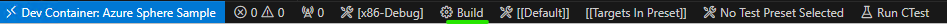

# Native Blink

This sample is an adaptation of the [HelloWorld_HighLevelApp](https://github.com/Azure/azure-sphere-samples/tree/main/Samples/HelloWorld/HelloWorld_HighLevelApp) sample, with the added ability to build and debug for native Linux.

## Contents

| File/folder                | Description |
|----------------------------|-------------|
| `.devcontainer`            | Folder containing the configuration of the Dev Container to use when opening the sample remotely. |
| `.vscode`                  | Folder containing the JSON files that configure Visual Studio Code for deploying and debugging the application. |
| `HardwareDefinitions`      | Folder containing the hardware definition files for various Azure Sphere boards. |
| `tests`                    | Folder containing the source code for the test driver of led.c. |
| `app_manifest.json`        | Application manifest file, which describes the resources. |
| `CMakeLists.txt`           | CMake configuration file, which Contains the project information and is required for all builds. |
| `CMakePresets.json`        | CMake presets file, which contains the information to configure the CMake project. |
| `launch.vs.json`           | JSON file that tells Visual Studio how to deploy and debug the application. |
| `led.c`, `led.h`, `main.c` | Source code files. |
| `LICENSE.txt`              | The license for this sample application. |
| `README.md`                | This README file. |

## Prerequisites

This sample does not require any additional hardware.

This sample requires the following additional software:
- [Docker Desktop](https://www.docker.com/products/docker-desktop/)
- [VS Code](https://code.visualstudio.com/download) OR [Visual Studio](https://visualstudio.microsoft.com/downloads/)
- [Dev Containers](https://marketplace.visualstudio.com/items?itemName=ms-vscode-remote.remote-containers) extension for VS Code

## Setup

Run the following command to download the container image:
```
docker pull mcr.microsoft.com/azurespheresdk:latest
```

## Configure Docker Desktop to run Linux containers

Ensure that Docker Desktop is configured to run Linux containers.  Right-click Docker Desktop menu; if you see the option to "Switch to Linux containers", then select it.  (If you see the option to "Switch to Windows containers", then Docker Desktop is already configured to run Linux containers.)

## VS Code

### Build and run the sample

1. Open VS Code, open the Command Palette (`Ctrl + Shift + P`), and run "Dev Containers - Open Folder in Container...".

    

2. Select this sample folder.

3. Use the Toolbar to select the configure preset "x86-Debug", and wait for CMake to finish generating the cache.

    

    (Alternatively, open the Command Palette, run the command "CMake: Select Configure Preset", select the "x86-Debug" Preset.)

    

> Hint: 
If this project had been built locally, you may need to open the Command Pallete, and run the command "CMake: Delete Cache and Reconfigure".

4. Use the Toolbar to build.

    

    (Alternatively, open the Command Palette and run the command "CMake: Build" to build.)

    

5. Open the Debug window (`Ctrl + Shift + D`), select the "Native Azure Sphere Launch" configuration, and press F5 to debug.

    

### Observe the output

When debugging, open the Terminal Window (Ctrl + `) to see program output, which should show the GPIO_SetValue call with 1 and 0 to simulate blinking an LED.

### Run Tests

1. Open the Testing window on the left (science flask icon) to view the CTests.

    

2. Click on the play icon to run the tests, or the play + bug icon with the "Test Azure Sphere Launch" configuration to debug the tests.

    

### Check for memory leaks

1. Use the Toolbar to select the configure preset "x86-Debug-Leak", and wait for CMake to finish generating the cache.

    (Alternatively, open the Command Palette, run the command "CMake: Select Configure Preset", select the "x86-Debug-Leak" Preset.)

2. Use the Toolbar to build.

    (Alternatively, open the Command Palette and run the command "CMake: Build" to build.)

3. Open the Terminal Window (Ctrl + `) and run the following command to start running Valgrind on the app:
```
valgrind --leak-check=full --show-leak-kinds=definite out/x86-Debug-Leak/HelloWorld_HighLevelApp
```

4. After the app runs for a while, stop the app (Ctrl + C) and observe the output from Valgrind. Note that Valgrind correctly identifies memory that is definitely lost in main():
```
HEAP SUMMARY:
    in use at exit: 146,511 bytes in 7 blocks
  total heap usage: 7 allocs, 0 frees, 146,511 bytes allocated

8 bytes in 2 blocks are definitely lost in loss record 2 of 6
   at 0x4848899: malloc (in /usr/libexec/valgrind/vgpreload_memcheck-amd64-linux.so)
   by 0x10931F: main (main.c:66)
```
## Visual Studio

### Build and run the sample

1. Open this folder in Visual Studio and wait for CMake to finish generating.

2. Select the "Reopen folder in container" link in the Dev Container Info Bar.

    (Alternatively, select the "[Dev Container]" option from the Target System dropdown menu)

3. Select the "x86-Debug" configuration from the Configuration dropdown menu and wait for CMake to finish generating.

4. Open the Build menu and select the "Build All" command (`Ctrl + Shift + B`) to build.

5. Select the "HelloWorld_HighLevelApp (Native)" item from the Startup Item dropdown menu and Select the "Start Debugging" command from the Debug Menu (`F5`) to start debugging.

### Observe the output

When debugging, the output should appear in the Output Window, which should show the GPIO_SetValue call with 1 and 0 to simulate blinking an LED.

### Run Tests

1. Open the Test menu and select the "Test Explorer" command to open the Test Explorer Window.

2. Click on the Play icon to run all the tests or right-click on a test and select the "Run" command to run an individual test.

3. Right-click on a test and select the "Debug" command to start debugging an individual test.

### Check for memory leaks

1. Select the "x86-Debug-Leak" configuration from the Configuration dropdown menu and wait for CMake to finish generating.

2. Open the Build menu and select the "Build All" command (`Ctrl + Shift + B`) to build.

3. Open the Debug menu and select the "Start Valgrind" command under the "Other Debug Targets" sub-menu to start running Valgrind on the app.

4. After the app runs for a while, open the Debug menu and select the "Stop Valgrind" command under the "Other Debug Targets" sub-menu to stop running Valgrind.

5. The Valgrind window will show that Valgrind correctly found a memory leak in main() as shown below, and if main.c is opened, the memory leak will be underlined with a warning message.
```
HEAP SUMMARY:
    in use at exit: 146,511 bytes in 7 blocks
  total heap usage: 7 allocs, 0 frees, 146,511 bytes allocated

8 bytes in 2 blocks are definitely lost in loss record 2 of 6
   at 0x4848899: malloc (in /usr/libexec/valgrind/vgpreload_memcheck-amd64-linux.so)
   by 0x10931F: main (main.c:66)
```

## Project expectations

### Expected support for the code

There is no official support guarantee for this code, but we will make a best effort to respond to/address any issues you encounter.

### How to report an issue

If you run into an issue with this code, please open a GitHub issue against this repo.

## Contributing

This project welcomes contributions and suggestions. Most contributions require you to
agree to a Contributor License Agreement (CLA) declaring that you have the right to,
and actually do, grant us the rights to use your contribution. For details, visit
https://cla.microsoft.com.

When you submit a pull request, a CLA-bot will automatically determine whether you need
to provide a CLA and decorate the PR appropriately (e.g., label, comment). Simply follow the
instructions provided by the bot. You will only need to do this once across all repositories using our CLA.

This project has adopted the [Microsoft Open Source Code of Conduct](https://opensource.microsoft.com/codeofconduct/).
For more information see the [Code of Conduct FAQ](https://opensource.microsoft.com/codeofconduct/faq/)
or contact [opencode@microsoft.com](mailto:opencode@microsoft.com) with any additional questions or comments.

## License

For details on license, see LICENSE.txt in this directory.
