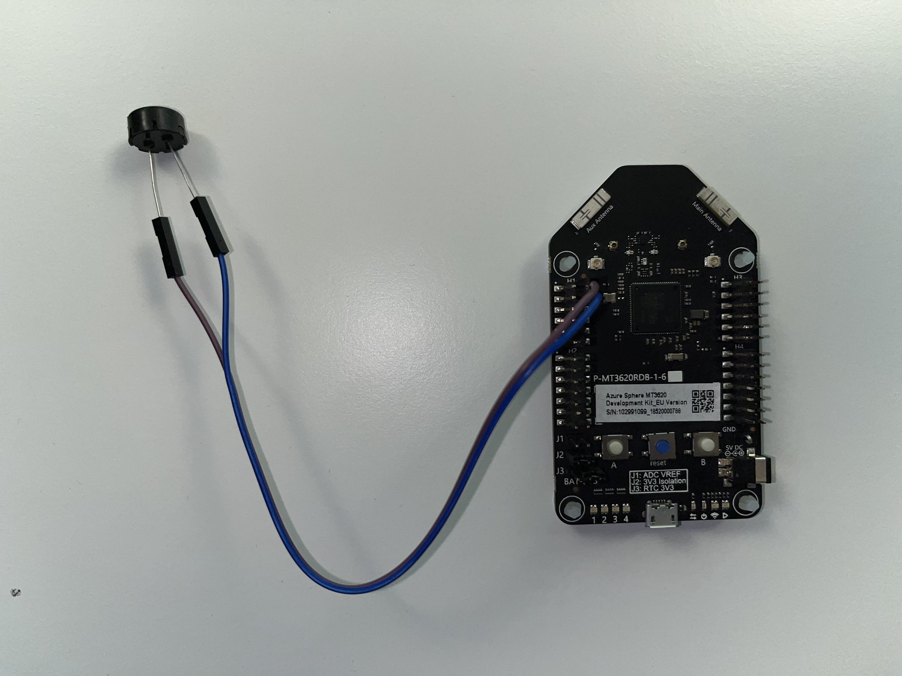
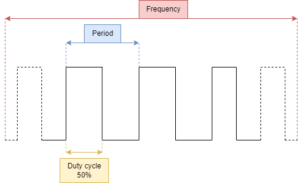
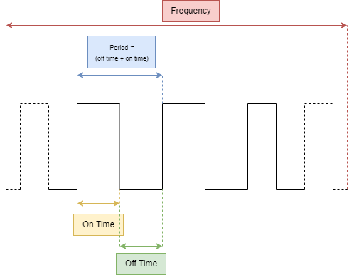

# PWM driven audio using the real time cores

This gallery project shows how to use the realtime cores to generate PWM (Pulse Width Modulation) audio with a compatible buzzer. It also provides additional understanding on how the PWM hardware module operates on the MT3620.

## Contents

| File/folder | Description |
|-------------|-------------|
| `/images` | The images used in this readme. |
| `/lib` | The CodeThink M4 (real time core) drivers. |
| `CMakeLists.txt` | The file that specifies how to build this project. |
| `main.c` | The source file containing the code to generate PWM audio. |
| `README.md` | This README file. |
| `LICENSE.txt`   | The license for the project. |

## Prerequisites

- An Azure Sphere-based device with development features (see [Get started with Azure Sphere](https://azure.microsoft.com/en-us/services/azure-sphere/get-started/) for more information).
- Setup a development environment for Azure Sphere (see [Quickstarts to set up your Azure Sphere device](https://docs.microsoft.com/en-us/azure-sphere/install/overview) for more information).
- A PWM driven buzzer (e.g. https://www.digikey.com/en/products/detail/tdk-corporation/PS1240P02BT/935924).

Note that the Azure Sphere Real-Time Core application is configured for the 22.11 SDK release.

## Using the project

1. Connect a buzzer to PWM0 and Ground as shown in this picture:

2. Configure the clock source to use for sound generation. At the top of `main.c`, there are macros to swap between clock sources used for PWM generation. To use the 2MHz clock source, ensure `USE_2M_SOURCE` is defined. To use the 32KHz clock source, ensure `USE_32K_SOURCE` is defined.

1. Ensuring the buzzer is adequately connected to the MT3620, build and deploy the application.

1. The buzzer will emit an ascending and descending C major scale.

To understand how PWM operation differs on the MT3620 real time cores to other microcontrollers, read on.

## PWM in general

PWM stands for pulse width modulation. PWM is often discussed with respect to the following terms: frequency, period and duty cycle. These terms are captured in the figure below as a reminder:

* Duty cycle - is the time a signal is active. In the figure, the duty cycle is "50%" because the signal is active (logical one) for 50% of the period.
* Period - is the time taken for the PWM signal to complete one cycle.
* Frequency - is the number of periods that occur in a specified timeframe, usually one second. For example, if a PWM signal was emitting the above signal at 50 times a second, the frequency would be: 1000/50 = 20 Hz.

## PWM on the MT3620

Though many chips allow the user to specify the frequency of the PWM module, the MT3620 does not. Instead, it allows the user to select a the clock frequency used to drive the PWM hardware peripheral, and tune the on and off time of the PWM signal. This is captured in the image below:

This requires a slight change in the mental model of how PWM works. Now, the period and frequency are defined by the on an off times written to the PWM peripheral.

As the on/off time registers are measured in ticks, we must calculate the register values based on the clock frequency used to drive the PWM. The resolution of the clock source therefore defines the minimum and maximum frequencies that can be generated by the PWM module.

There are three clock sources available to the PWM module:

* 32KHz - the PWM signal can change every 31 microseconds (1000000 / 32768).
* 2MHz - the PWM signal can change every 0.5 microseconds (1000000 / 2000000).
* XTAL - defined per board (if available).

It therefore stands to reason that if high frequency signals are required, the PWM module should be configured with the 2MHz clock source. For audio purposes, either the 32KHz or 2MHz clock source should be adequate.

### Calculating the desired PWM frequency

Given a frequency in Hertz, we can calculate the parameters to the PWM peripheral required to achieve that frequency. The following steps calculate the on/off register values for 440 Hz (the note A):

1. Calculate the required period of the PWM signal to achieve the given frequency: 1000000/440 = 2272 microseconds.

1. Audio signals typically have a 50% duty cycle, divide the PWM period by two: 2272 / 2 = 1136 microseconds. This will be the basis of the value for both on and off.

1. Finally, convert the on and off value to be in terms of clock ticks. For example, if the clock frequency is 32 KHz (32768), the on/off values must be multiplied as follows: 1136 / (1000000/32768) = 37 clock ticks.

Note that when calculating on/off register values for a 2MHz clock, values must be calculated with respect to nanoseconds (replace 1000000 with 1000000000).

## Expected support for the code

This code is not formally maintained, but we will make a best effort to respond to/address any issues you encounter.

## How to report an issue

If you run into an issue with this code, please open a GitHub issue against this repo.

## Contributing

This project welcomes contributions and suggestions. Most contributions require you to
agree to a Contributor License Agreement (CLA) declaring that you have the right to,
and actually do, grant us the rights to use your contribution. For details, visit
https://cla.microsoft.com.

When you submit a pull request, a CLA-bot will automatically determine whether you need
to provide a CLA and decorate the PR appropriately (e.g., label, comment). Simply follow the
instructions provided by the bot. You will only need to do this once across all repositories using our CLA.

This project has adopted the [Microsoft Open Source Code of Conduct](https://opensource.microsoft.com/codeofconduct/).
For more information see the [Code of Conduct FAQ](https://opensource.microsoft.com/codeofconduct/faq/)
or contact [opencode@microsoft.com](mailto:opencode@microsoft.com) with any additional questions or comments.

## License

See [LICENSE.txt](./LICENSE.txt)