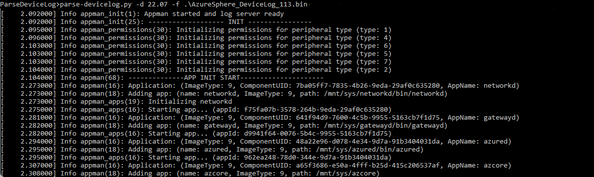

## Azure Sphere - Parse Device Logs  Packages and Tools

This folder contains the following tools for parsing the `AzureSphere_DeviceLog_nnn.bin` device log file and displaying the information contained in the file in an easy-to-read format. The file is generated when you run the [**azsphere get-support-data**](https://docs.microsoft.com/azure-sphere/reference/azsphere-get-support-data?tabs=cliv2beta) CLI command. It contains diagnostic data for the attached device, including connectivity and device state information.

- **parse-devicelog.py**

   Parses the device log binary file into human-readable format.

   Parameters:

     `-d` path to OS manifest directory

     `-f` devicelog bin filename path
  
   Example:

     `c:> parse-devicelog.py -d 22.07 -f AzureSphere_DeviceLog_113.bin`

- **error-code.py**

   Called by **parse-devicelog.py** to retrieve error-code information from the [OS]\commonerror_yml folder.

## Contents

| File/folder | Description |
|-------------|-------------|
|`22.07`, `22.09` folders  |  Contain the OS log_manifest and commonerror_yml files.|
|`parse-devicelog.py`|Contains the logic for parsing the device log binary file into human-readable format.|
|`error-code.py`|Imports error-code info from the [OS]\commonerror_yml folder.|
| `README.md` | This README file. |
| `LICENSE.txt`  | The license for the project. |

## Prerequisites

- [Python 3.10.7 or later](https://www.python.org/downloads/) and [YAML](https://pypi.org/project/PyYAML/#files).
- An Azure Sphere-based device with development features (see [Get started with Azure Sphere](https://azure.microsoft.com/en-us/services/azure-sphere/get-started/) for more information).
- Set up a development environment for Azure Sphere (see [Quickstarts to set up your Azure Sphere device](https://docs.microsoft.com/en-us/azure-sphere/install/overview) for more information).

## How to use

1. Run the [**azsphere get-support-data**](https://docs.microsoft.com/azure-sphere/reference/azsphere-get-support-data?tabs=cliv2beta) command to generate the support data and download it to your computer.
The support data is a set of log files, including the device log file `AzureSphere_DeviceLog_nnn.bin`, bundled in a single compressed .zip file. For example, the following command will generate a compressed file called logs.zip that contains the set of log files.

      `azsphere get-support-data --destination logs.zip`

1. Extract the device log file from the .zip file.

1. Open the command prompt or Windows Power Shell, navigate to the directory that contains the sample and run `parse-devicelog.py` giving the path to the device log file.
    For example:

     - In the command prompt window

          `c:> parse-devicelog.py -d 22.07 -f <path to device log file>\AzureSphere_DeviceLog_113.bin`

     - In Windows Powershell

         `c:>./parse-devicelog.py -d 22.07 -f <path to device log file>/AzureSphere_DeviceLog_113.bin`

      The AzureSphere_DeviceLog_113.bin file's contents will be displayed in the CLI.

      

### Expected support for the code

This code is not formally maintained, but we will make a best effort to respond to and address any issues you encounter.

### How to report an issue

If you run into an issue with this code, please open a GitHub issue against this repo.

## Contributing

This project welcomes contributions and suggestions. Most contributions require you to
agree to a Contributor License Agreement (CLA) declaring that you have the right to,
and actually do, grant us the rights to use your contribution. For details, visit https://cla.microsoft.com.

When you submit a pull request, a CLA-bot will automatically determine whether you need
to provide a CLA and decorate the PR appropriately (for example, label, comment). Simply follow the
instructions provided by the bot. You will only need to do this once across all repositories using our CLA.

This project has adopted the [Microsoft Open Source Code of Conduct](https://opensource.microsoft.com/codeofconduct/).
For more information, see the [Code of Conduct FAQ](https://opensource.microsoft.com/codeofconduct/faq/)
or contact [opencode@microsoft.com](mailto:opencode@microsoft.com) with any additional questions or comments.

## License

See [LICENSE.txt](./LICENSE.txt)
