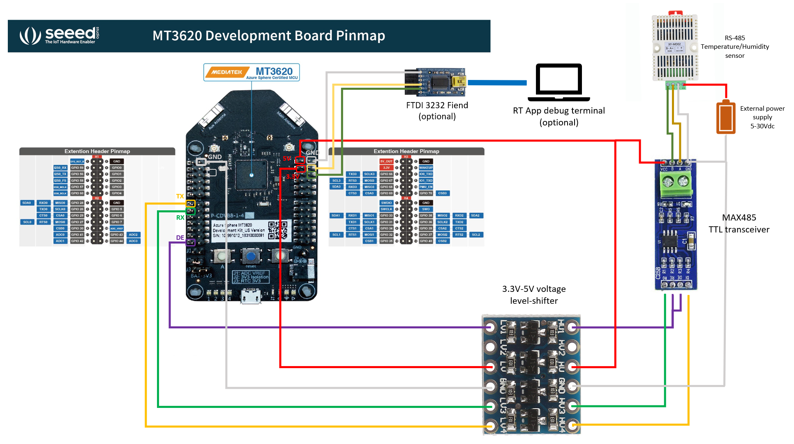

# RS-485 real-time driver with HL-Core interfacing API

This project implements a light weight RS-485 driver running one of the M4 cores in the MT3620, which leverages the low-level access to the UART's hardware registers for reliable communications. The RS-485 real-time driver then also leverages the [mailbox inter-core communication feature of the MT3620](https://docs.microsoft.com/azure-sphere/app-development/high-level-inter-app), for receiving/sending messages from/to the HL-Core App.

Together with the RS-485 real-time driver, the project includes an high-level RS-485 driver API and a sample App (HLApp). The sample App shows how to initialize the HL-Core RS-485 driver, and send/receive data by leveraging its simple API interface.

 The high-level & real-time RS-485 drivers and sample use the following Azure Sphere and 3rd-party libraries.

| Library | Purpose |
|---------|---------|
| [application](https://docs.microsoft.com/en-us/azure-sphere/reference/applibs-reference/api-overview) | Communicates with and controls the real-time capable application. |
| [eventloop](https://docs.microsoft.com/azure-sphere/reference/applibs-reference/applibs-eventloop/eventloop-overview) | Invokes handlers for timer events. |
| [log](https://docs.microsoft.com/azure-sphere/reference/applibs-reference/applibs-log/log-overview) | Displays messages in the Device Output window during debugging. |
| [CodethinkLabs mt3620-m4-drivers](https://github.com/CodethinkLabs/mt3620-m4-drivers) | Open source libraries implementing peripheral drivers for MT3620's M4 real-time cores. |


## Contents

| File/folder | Description |
|-------------|-------------|
| `README.md` | This README file. |
| `rs485.code-workspace` | A Visual Studio Code workspace file that allows building and debugging the real-time and the high-level app at the same time. |
| `launch.vs.json` | JSON file that tells Visual Studio how to deploy and debug the application. |
| `common_defs.h` | Contains common definitions between the HLApp and RTApp. |
| `HLApp` | Folder containing the configuration files, source code files, and other files needed for the high-level application. |
| `RTApp` | Folder containing the configuration files, source code files, and other files needed for the RS-485 driver real-time  application. |
| `HLApp\rs485_hl_driver.h/c` | The RS-485 driver API implementation, isolates from direct inter-core communications by abstracting Init/Read/Write operations
| `RTApp\ringBuffer.h/c` | Generic ring-buffer implementation for storing bytes received on the UART peripheral. |
| `RTApp\rs485_driver.h/c` | The RS-485 driver implementation, isolates from direct UART operation by abstracting Init/Read/Write operations. |


## Prerequisites

- [Seeed MT3620 Development Kit](https://aka.ms/azurespheredevkits) or other hardware that implements the [MT3620 Reference Development Board (RDB)](https://docs.microsoft.com/azure-sphere/hardware/mt3620-reference-board-design) design.
- (Optional) A USB-to-serial adapter (for example, [FTDI Friend](https://www.digikey.com/catalog/en/partgroup/ftdi-friend/60311)) to connect the real-time capable core UART to a USB port on your PC.
- (Optional) A terminal emulator, such as Telnet or [PuTTY](https://www.chiark.greenend.org.uk/~sgtatham/putty/), to display the RTApp's output.
- A voltage level-shifter, to interface the 3.3V UART of the MT3620 to a TTL RS-485 transceiver (for example, [3.3V-5V 4 Channels Logic Level Converter Bi-Directional Shifter Module](https://www.amazon.com/FTCBlock-3-3V-5V-Channels-Converter-Bi-Directional/dp/B07H2C6SJJ/ref=sr_1_1_sspa?dchild=1&keywords=level+shifter&qid=1628280388&s=electronics&sr=1-1-spons&psc=1&spLa=ZW5jcnlwdGVkUXVhbGlmaWVyPUEyU0ZUTVZLRzFFOU1CJmVuY3J5cHRlZElkPUEwMzcwMjA0MkxUTTdHRTFBRjRXVyZlbmNyeXB0ZWRBZElkPUExMDE2MDY4Mzc2STZHVzBPMDRXVCZ3aWRnZXROYW1lPXNwX2F0ZiZhY3Rpb249Y2xpY2tSZWRpcmVjdCZkb05vdExvZ0NsaWNrPXRydWU=)).
- A TTL RS-485 transceiver device, for driving the RS-485 field bus (for example, [MAX485 Chip Module TTL to RS-485 Instrument Interface Module](https://www.amazon.com/MAX485-Module-RS-485-Instrument-Interface/dp/B01N8WLEV0/ref=asc_df_B01N8WLEV0/?tag=hyprod-20&linkCode=df0&hvadid=216534554317&hvpos=&hvnetw=g&hvrand=4726439281244768822&hvpone=&hvptwo=&hvqmt=&hvdev=c&hvdvcmdl=&hvlocint=&hvlocphy=9033288&hvtargid=pla-350870533393&psc=1)).
- An RS-485 device and its related protocol documentation (for example, [Temperature Humidity Transmitter SHT20 Sensor High Precision Monitoring Modbus RS-485](https://www.amazon.com/gp/product/B07SZSSNRP/ref=ppx_yo_dt_b_asin_title_o00_s00?ie=UTF8&psc=1)).

  **Note:** If the RS-485 device is not 5V-compatible, a separate power source could be required, to power the device-only, and its GND must be connected to a GND pin on Azure Sphere development board.

## Setup

1. Clone the [Azure Sphere Gallery](https://github.com/Azure/azure-sphere-gallery) repository and find the *RS-485 Driver* project in the *RS485Driver* folder or download the zip file from GitHub.

1. Prepare your device on Windows or Linux.

   **To prepare your device on Windows:**

   1. Open the [Azure Sphere command-line tool](https://docs.microsoft.com/azure-sphere/reference/overview) with administrator privileges. 

      Administrator privileges are required for enabling real-time core debugging because it installs USB drivers for the debugger.

   1. Enter the [**azsphere device enable-development**](https://docs.microsoft.com/azure-sphere/reference/azsphere-device#enable-development) command as follows:  

       Azure Sphere CLI:

       ```
       azsphere device enable-development --enable-rt-core-debugging
       ```

       Azure Sphere classic CLI:

       ```
       azsphere device enable-development --enablertcoredebugging
       ```

   1. Close the window after the command completes because administrator privilege is no longer required. As a best practice, you should always use the lowest privilege that can accomplish a task.

   **To prepare your device on Linux:**

   1. Enter the [**azsphere device enable-development**](https://docs.microsoft.com/azure-sphere/reference/azsphere-device#enable-development) command as follows:  

       Azure Sphere CLI:

       ```
       azsphere device enable-development --enable-rt-core-debugging
       ```

       Azure Sphere classic CLI:

       ```
       azsphere device enable-development --enablertcoredebugging
       ```

1. (Optional) Set up the hardware to display output from the RTApp. For instructions, see [Set up hardware to display output](https://docs.microsoft.com/azure-sphere/install/qs-real-time-application#set-up-hardware-to-display-output).

## How to use

### Wiring diagram
The following diagram shows how to connect all the devices listed in the [Prerequisites](##Prerequisites).

**Note** that the *FTDI  Friend* and RTApp degug terminal are optional, if you are not interested in visualizing logs from the real-time RS485 driver (RTApp):



### Configuration
1. Configure the HL App's max message size in `common_defs.h` to match your communication requirements:
    ```c
    // This is the maximum message size that the HLApp can send
    // to the RS-485 RTApp driver. This header is used by both Apps.
    #define MAX_HLAPP_MESSAGE_SIZE	64

    // This is essentially the buffering time (in milliseconds),
    // after which the real-time RS485 driver will send out 
    // any received bytes to the HLApp.
    #define RTDRV_SEND_DELAY_MSEC	10
    ```
2. Configure the driver defines in `rs485_driver.h` to match your hardware setup (i.e. the below values match what illustrated in the [Wiring diagram](###Wiring-diagram)):
    ```c
    //////////////////////////////////////////////////////////////////////////////////
    // GLOBAL VARIABLES
    //////////////////////////////////////////////////////////////////////////////////
    #define DRIVER_ISU                 MT3620_UNIT_ISU0
    #define DRIVER_ISU_DEFAULT_BAURATE 9600
    #define DRIVER_DE_GPIO             42
    #define DRIVER_MAX_RX_BUFFER_SIZE  2000
    ```
3. Comment/uncomment the `DEBUG_INFO` definition in `RTApp\main.c`, wither or not the App is ready for production (for saving MCU cycles):
      ```c
      #define DEBUG_INFO
      ```
4. In the HL App, just initialize the RS-485 driver through  `Rs485_Init()`, and write & read bytes as per the protocol definitions of your RS-485 device (i.e. Modbus, RS-232, etc.).

    In the current implementation, the HL App cycles every 3 seconds and sends three commands through the `Rs485_Send()` API function: the first sets the RS-485 real-time driver's baudrate to 9600 and the subsequent two are specific Modbus commands of a popular and cheap (chosen for sourcing simplicity) RS-485 Modbus temperature/humidity device based on an SHT20 sensor:

    ```c
    static void SendTimerEventHandler(EventLoopTimer *timer)
    {
      static int currCommand = 0;
      static const message_t commands[] = {

        { "\xff\xff\xff\xff\x80\x25\x00\x00", 8},  // Change baud rate on the RS-485 driver (Note: invert endianness in the baudrate value!)
        { "\x01\x04\x00\x01\x00\x01\x60\x0A", 8},  // Measure temperature
        { "\x01\x04\x00\x02\x00\x01\x90\x0A", 8},  // Measure humidity
      };
      ...
      ...
    ```
    **Note**: the RS-485 real-time driver can receive a **special byte-command to change the UART's baudrate on-the-fly**. The format is very simple: four trailing `0xFF` bytes, followed by the four bytes (`uint32_t`) representing the desired baudrate value, in **big-endian** format.
    
    .e. for setting the RS-485 UART to 9600 baud, the byte-command to be sent is:

    ```
    [0xff 0xff 0xff 0xff 0x80 0x25 0x00 0x00] (8 bytes)
    ```
    The driver will return an 8-byte response: on success it'll return `[0xff 0xff 0xff 0xff 0x00 0x00 0x00 0x00]`, on failure it'll return `[0xff 0xff 0xff 0xff 0xff 0xff 0xff 0xff]`.

5. Responses from the RS-485 real-time driver are received by the HL-Core APIs within the `Rs485EventHandler()` callback function and byte-buffer, with which the RS-485 driver was initialized. The callback function must be of type `Rs485ReceiveCallback`.

### Build and run the sample

The applications in this sample run as partners. Make sure that they're designated as partners, as described in [Mark applications as partners](https://docs.microsoft.com/azure-sphere/app-development/sideload-app#mark-applications-as-partners), so that sideloading one doesn't delete the other.

If you're using Visual Studio or Visual Studio Code, you will need to deploy and debug both apps simultaneously. See the following instructions for building and running
the sample with Visual Studio or Visual Studio Code.

**To build and run the sample with Visual Studio:**

1. On the **File** menu, select **Open > Folder**.
1. Navigate to the *RS485Driver* sample directory, and click **Select Folder**.
1. On the **Select Startup Item** menu, select **RS-485 Driver Sample (All Cores)**.
1. On the **Build** menu, select **Build All**.
1. On the **Debug** menu, select **Start**, or press **F5**.

**To build and run the sample with Visual Studio Code:**

1. Use the [Visual Studio Code Multi-root Workspaces](https://code.visualstudio.com/docs/editor/multi-root-workspaces) feature to build and debug the RTApp and high-level app at the same time.
1. On the **File** menu, **Select Open Workspace**.
1. Navigate to the *RS485Driver* root directory and select the file `rs485.code-workspace`. 
1. Click **Open**.
1. After the build files have been created, right-click on either of the two `CMakeLists.txt` files and select **Build All Projects**.
1. Click the **Run** icon in the menu on the left side of the screen.
1. On the pull-down menu, that appears at the top of the window on the left side of the screen, select **Launch for azure Sphere Applications (gdb)(workspace)**.
1. On the **Run** menu, select **Start Debugging**. 

If you're running the sample from the command line you will need to build and run the RTApp before you build and run the high-level app. For more information about building real-time capable and high-level applications from the command line, go to [Build a sample application](../../BUILD_INSTRUCTIONS.md) and click on the links *Tutorial: Build a real-time capable application* and *Build and run a high-level sample with the CLI* respectively.

## Example

Once every second, the high-level application sends a message to the RS-485 driver to request in turn:

- a baudrate change
- a temperature reading
- a humidity measurement 

to an RS-485 sensor (the one used is a cheap temperature/humidity sensor based on the SHT20, easily sourceable online). 

The real-time RS-485 driver (RTApp) then takes care of sending the message over UART by driving the DE/!RE pins of a MAX485 transceiver. As soon as the RS-485 driver (RTApp) receives a (reply) message over UART, it immediately buffers it on an *RX ring-buffer* (for lossless receiving). The ring buffer is then used by a separate a GPT timer callback function, which in turn sends a message to the HLApp if any bytes are stored in the *RX ring buffer* (up to the maximum defined in `MAX_HLAPP_MESSAGE_SIZE`).

Finally, the HLApp simply prints the received message (coming from the RS-485 sensor device) within the `Rs485EventHandler()` callback function (with which the RS-485 driver was initialized). The high-level application output will be displayed in the Output window in Visual Studio or Visual Studio Code. The output will look like this (dependently of the RS-485 device used):

```sh
Remote debugging from host 192.168.35.1, port 57375
High-level RS-485 comms application
Sends messages to, and receives messages from an RS-485 driver running on the RT-Core.
Rs485_Driver: sending 8 bytes: ff:ff:ff:ff:80:25:00:00
Rs485_Driver: received 8 bytes: ff:ff:ff:ff:00:00:00:00
Rs485 Callback: received 8 bytes: ff:ff:ff:ff:00:00:00:00
Rs485_Driver: sending 8 bytes: 01:04:00:01:00:01:60:0a
Rs485_Driver: received 7 bytes: 01:04:02:01:38:b9:72
Rs485 Callback: received 7 bytes: 01:04:02:01:38:b9:72
Rs485_Driver: sending 8 bytes: 01:04:00:02:00:01:90:0a
Rs485_Driver: received 7 bytes: 01:04:02:01:bc:b9:11
Rs485 Callback: received 7 bytes: 01:04:02:01:bc:b9:11
...
```

Because the HLApp and RTApp work asynchronously for the maximum efficiency, messages may not correspond in their sequence.

The real-time capable application output will be sent to the serial terminal for display. With `DEBUG_INFO` defined, the output will look like this (with the RS-485 device used in this sample):

```sh
RS-485 real-time driver
App built on: Aug 8 2021, 13:23:18
Changing baud rate to 9600 --> OK
Received 8 bytes from HLApp: 01:04:00:01:00:01:60:0a --> sending to RS-485 field bus
Received 7 bytes from RS-485 bus: 01:04:02:01:38:b9:72
Sending 7 bytes to HLApp: 01:04:02:01:38:b9:72
Received 8 bytes from HLApp: 01:04:00:02:00:01:90:0a --> sending to RS-485 field bus
Received 7 bytes from RS-485 bus: 01:04:02:01:bc:b9:11
Sending 7 bytes to HLApp: 01:04:02:01:bc:b9:11
...
```

Again, the numbers in the messages may start from different places.


## Key concepts

The RS-485 driver basically wraps M4 UART libraries and instantly buffers all UART received bytes on IRQs, in order to abstract the communications with RS-485 devices and take care of communication-timing details, which that have been specifically tuned with signal scoping at the wire level. This way developers don't have to worry about performances during the TX/RX operations that may arise from driving the RS-485 communications directly from the HLApp with UART & GPIO interactions.

Several high-level protocols, such as Modbus/Profinet/etc. can be developed on top of the RS-485 real-time driver, directly from within the high-level application code, by just handling the TX/RX byte-streams from the RS-485 deiver APIs, without worrying about the critical wire-timings for the physical field bus.


References:
- For an overview of Azure Sphere, see [What is Azure Sphere](https://docs.microsoft.com/azure-sphere/product-overview/what-is-azure-sphere).
- To learn about partner-application development, see [Create partner applications](https://docs.microsoft.com/azure-sphere/app-development/create-partner-apps).
- To learn about how a high-level application communicates with an RTApp, see [Communicate with a real-time capable application](https://docs.microsoft.com/azure-sphere/app-development/high-level-inter-app).
- To learn more about the open source libraries implementing drivers for MT3620's M4 real-time cores, see [CodethinkLabs mt3620-m4-drivers](https://github.com/CodethinkLabs/mt3620-m4-drivers).


## Project expectations

This library can be used when interfacing an Azure Sphere based device to an RS-485 field bus, where deterministic reading speed on the bus is required, supported by the RS-485 driver running on the MT3620's M4 real-time core and RX buffering, which decouples IRQ handling from the inter-core communication with the A7-core through the mailbox.

### Expected support for the code

There is no official support guarantee for this code, but we will make a best effort to respond to/address any issues you encounter.

### How to report an issue

If you run into an issue with this script, please open a GitHub issue against this repo.

## Contributing

This project welcomes contributions and suggestions. Most contributions require you to
agree to a Contributor License Agreement (CLA) declaring that you have the right to,
and actually do, grant us the rights to use your contribution. For details, visit
https://cla.microsoft.com.

When you submit a pull request, a CLA-bot will automatically determine whether you need
to provide a CLA and decorate the PR appropriately (e.g., label, comment). Simply follow the
instructions provided by the bot. You will only need to do this once across all repositories using our CLA.

This project has adopted the [Microsoft Open Source Code of Conduct](https://opensource.microsoft.com/codeofconduct/).
For more information see the [Code of Conduct FAQ](https://opensource.microsoft.com/codeofconduct/faq/)
or contact [opencode@microsoft.com](mailto:opencode@microsoft.com) with any additional questions or comments.

## License

For information about the licenses that apply to this script, see [LICENSE.txt](./LICENSE.txt)