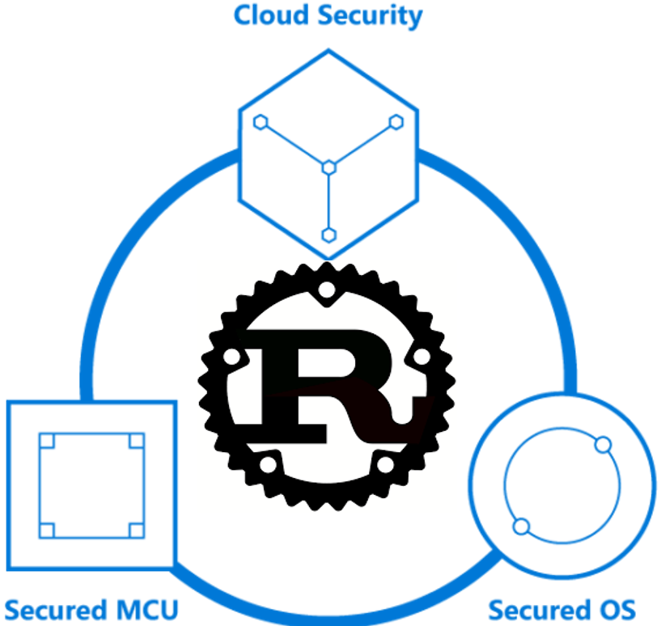

# Rust for Azure Sphere

:construction: :construction: **This project is highly experimental.** :construction: :construction:
It should not be used in production workloads.

## Introduction

Welcome to the **Rust for Azure Sphere** repository! This repo contains sample applications written in Rust that can be compiled and targeted against Azure Sphere devices.

 

    
 

## What is Azure Sphere?
Azure Sphere is a secured, high-level application platform with built-in communication and security features for internet-connected devices. It comprises a secured, connected, crossover microcontroller unit (MCU), a custom high-level Linux-based operating system (OS), and a cloud-based security service that provides continuous, renewable security.

For more information, please see the [Azure Sphere documentation](https://docs.microsoft.com/en-us/azure-sphere/).

 ## Why Rust
Rust is a systems programming language with a focus on performance and safety. Two things that are critical and at the core of what embedded systems developers are constantly thinking about. In addition to the above, the following are some specifics:

- Rust performs lots of strict compile time safety checks. The added safety along with the checks being performed at compile time make it ideal given the scarce resources at runtime on embedded devices.
- As a systems language, it offers low level control.
- It has a thriving community and has been voted the most loved language on Stack Overflow's developer survey every year since 2015!

## Documentation

> The contributing and quickstart guides requires the use of a Linux machine or a Windows machine running Windows Subsystem for Linux (WSL).  Ubuntu is preferred.

[Quickstart](./docs/quickstart.md)

[Contributing Guide](./docs/contributing.md)

[Release Notes](./docs/relnotes.md)

## Building

- Use `cargo build` or `cargo build --release` to compile.
- Use `cargo azsphere package` in any app directory, to generate the Azure Sphere .imagepackage file.
- Use `cargo azsphere sideload` in any app directory, to sideload the application onto a device.  Pass "-m" for manual-launch.
- Use `cargo azsphere debug` in any app directory, to launch gdb and debug the application.

## Code of Conduct

This project has adopted the [Microsoft Open Source Code of
Conduct](https://opensource.microsoft.com/codeofconduct/).

For more information see the [Code of Conduct
FAQ](https://opensource.microsoft.com/codeofconduct/faq/) or contact
[opencode@microsoft.com](mailto:opencode@microsoft.com) with any additional questions or comments.
