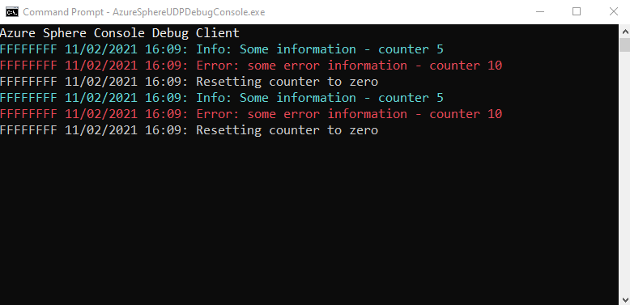

# UdpDebugLog Library

The goal of the socket UdpDebugLog library is to provide a mechanism to view debug data from a device that's not connected to Visual Studio/Visual Studio Code, but is connected to the network.

Note that the socket Log_Debug library uses a UDP socket to send the Log_Debug information, the implementation could be easily modified to send the Log_Debug data to a UART or other interface.

For more information on Log_Debug usage, see [Log_Debug function](https://docs.microsoft.com/en-us/azure-sphere/reference/applibs-reference/applibs-log/function-log-debug)

## Contents

| File/folder | Description |
|-------------|-------------|
| `src\SphereUdpLogSender`       | Azure Sphere Sample App source code |
| `src\PcUdpLogReceiver`       | .NET Core 3.1 application for viewing Socket Log messages |
| `Assets`       | Images used in README.txt |
| `README.md` | This README file. |
| `LICENSE.txt`   | The license for the project. |

## Prerequisites & Setup

- An Azure Sphere-based device with development features (see [Get started with Azure Sphere](https://azure.microsoft.com/en-us/services/azure-sphere/get-started/) for more information).
- Setup a development environment for Azure Sphere (see [Quickstarts to set up your Azure Sphere device](https://docs.microsoft.com/en-us/azure-sphere/install/overview) for more information).

Note that the Azure Sphere High Level application is configured for the 21.01 SDK release.

## How to use

Enable the `add_compile_definitions(USE_SOCKET_LOG)` line in CMakeLists.txt to enable the socket Log_Debug functionality.

* Build and run the [PcUdpLogReceiver](./PcUdpLogReceiver) application on your PC
* Open, build, and run the [SphereUdpLogSender](./SphereUdpLogSender) project in Visual Studio/Code

The AzureSphereUDPDebugConsole application should display the following:

The PcUdpLogReceiver looks for a received message starting with 'information' or 'info' and displays these strings in Cyan color. Any received message that starts with 'warning' or 'error' will be displayed in Red color.

## Udp and Device Id
UdpDebugLog uses UDP to broadcast to the local network, UDP allows for multiple devices on the same network to broadcast to one or more PC based listening applications.

The Log_Debug message function in UdpLog.c uses the first four bytes of the UDP buffer to hold an ID that can be used to uniquely identify a device that's sending data, the four bytes default to a value of 0xffffffff (which you will see displayed in the PcUdpLogReceiver application).

The PcUdpLogReceiver application defaults to showing Log_Debug data from any Azure Sphere device that's using the SphereUdpLogSender code on the local network, you can filter messages in the PcUdpLogReceiver application by specifying a 4 byte hex value as the parameter to the desktop application - for example:

`PcUdpLogReceiver 466f6f2e`

Note that you will also need to modify lines 46-49 of udplog.c to set the client side 4 byte hex values - the value could be generated from part of the [device MAC address](https://docs.microsoft.com/en-us/azure-sphere/reference/applibs-reference/applibs-networking/function-networking-gethardwareaddress), or generated through some other mechanism and persisted in Mutable storage rather than being hard coded in the udplog.c file.

## Example

The sample code in `main.c` has a loop which contains a counter that is incremented once a second, at 5, 10, 15, and 20 seconds a Log_Debug message will be generated, the desktop client application will display the messages if USE_SOCKET_LOG is defined in CMakeLists.txt - if this is not defined then the default Log_Debug behavior is used (output to the Visual Studio/Code debug window).

## Project expectations

* The code has been developed to assist with debugging scenarios.

### Expected support for the code

This code is not formally maintained, but we will make a best effort to respond to/address any issues you encounter.

### How to report an issue

If you run into an issue with this code, please open a GitHub issue against this repo.

## Contributing

This project welcomes contributions and suggestions. Most contributions require you to
agree to a Contributor License Agreement (CLA) declaring that you have the right to,
and actually do, grant us the rights to use your contribution. For details, visit
https://cla.microsoft.com.

When you submit a pull request, a CLA-bot will automatically determine whether you need
to provide a CLA and decorate the PR appropriately (e.g., label, comment). Simply follow the
instructions provided by the bot. You will only need to do this once across all repositories using our CLA.

This project has adopted the [Microsoft Open Source Code of Conduct](https://opensource.microsoft.com/codeofconduct/).
For more information see the [Code of Conduct FAQ](https://opensource.microsoft.com/codeofconduct/faq/)
or contact [opencode@microsoft.com](mailto:opencode@microsoft.com) with any additional questions or comments.

## License

See [LICENSE.txt](./LICENCE.txt)