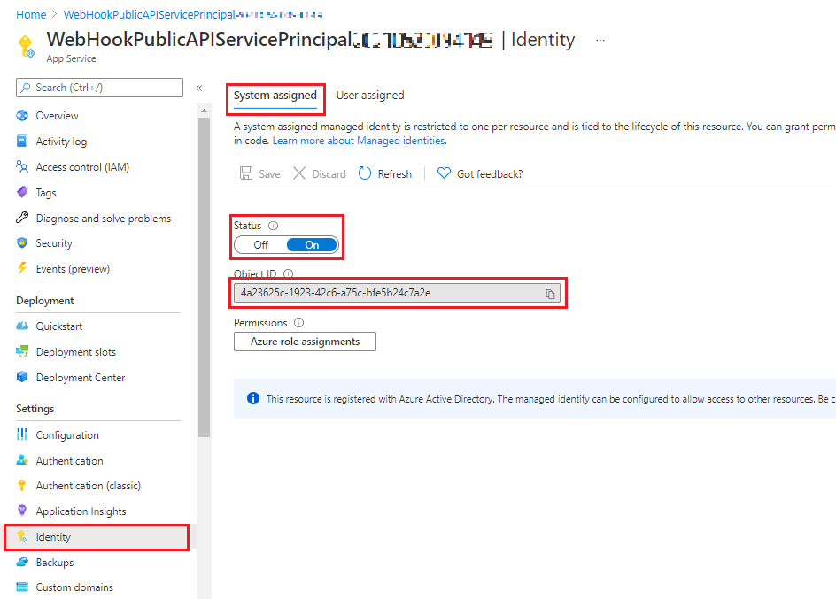

# WebHookPublicAPIServicePrincipal project

The goal of this project is to show how to use the Azure Sphere Public API with Azure Active Directory Service Principal authentication.

## Contents

| File/folder | Description |
|-------------|-------------|
| `src\WebHookPublicAPIServicePrincipal`       | ASP.NET Core REST API project |
| `README.md` | This README file. |
| `LICENSE.txt`   | The license for the project. |

## Prerequisites & Setup

- An Azure Sphere-based device with development features (see [Get started with Azure Sphere](https://azure.microsoft.com/services/azure-sphere/get-started/) for more information).
- Setup a development environment for Azure Sphere (see [Quickstarts to set up your Azure Sphere device](https://docs.microsoft.com/azure-sphere/install/overview) for more information).


## How to use

The project is written in C#, it's an ASP.NET Core 3.1 App Service project that exposes two REST APIs, these are:

* `root` (HTTP/GET) which will display a message showing that the App Service is running
* `webhook` (HTTP/GET) which uses the Azure Sphere Public API to get information for a device in a specific Azure Sphere tenant, the Device Id is supplied as a query parameter on the Webhook URL.

The [Azure Sphere Public API](https://docs.microsoft.com/rest/api/azure-sphere) requires an authentication token, this is obtained through a Service Principal which is linked to a user in your Azure Sphere tenant (details on creating the user are below).

You will need the following:
* Azure Sphere device claimed into a tenant (to test App Service)
* **Azure Sphere Tenant Id** Use the Azure Sphere command line interface (CLI) and run `azsphere tenant show-selected` (you can also use the `azsphere tenant list` and `azsphere tenant select` commands to select a different tenant).
* **Azure Subscription/Tenant Id** Log into the [Azure Portal](https://portal.azure.com) and search for `tenant`, select `tenant properties` and copy the Tenant Id (this will be a GUID)

### Add the Azure Sphere Application to your Azure Tenant (one time setup)

* Open Powershell - and install the Azure AD module

```dos
Install-Module AzureAD
```

* Run the following commands:

```dos
Connect-AzureAD -TenantId <<Your Azure Tenant Id>>
```
Note that the GUID used in the following command is a fixed value and defines the Azure Sphere API Application ID which needs to be added to your tenant.

```dos
New-AzureADServicePrincipal -AppId 7c209960-a417-423c-b2e3-9251907e63fe -DisplayName "Azure Sphere API"
```

### Modify the WebHookPublicAPIServicePrincipal project

There's only one change you need to make to the WebHookPublicAPIServicePrincipal project.

* In Controllers/DeviceController.cs, set AzureSphereTenantId to be your tenant Id (example below)

```cpp
private static string AzureSphereTenantId = "";     // TODO: add your Azure Sphere Tenant Id (azsphere tenant show-selected)
```

### Build and Deploy the WebHookPublicAPIServicePrincipal project to Azure

Open the [WebHookPublicAPIServicePrincipal project](./WebHookPublicAPIServicePrincipal/WebHookPublicAPIServicePrincipal.sln)

Use the Visual Studio Publish Wizard (Build | Publish) to publish the WebHookPublicAPIServicePrincipal project to Azure. 

Once the WebHookPublicAPIServicePrincipal project is deployed to Azure copy the project endpoint URL to the clipboard (this will be displayed in the build output window, and also in your browser once the project is deployed) - you will use this to test the service.

Note that once the project is deployed you will see a web page open that states that the 'page cannot be found' - this is expected, there isn't a REST API on the base URL for the project.

You can test that the WebHookPublicAPIServicePrincipal project is running by opening your web browser and navigating to the App Service published URL/root - this should display a message showing that the **API Service is running**.

### Register the user in the Azure Sphere tenant.

You will need:

* Your Azure Sphere Tenant Id `azsphere tenant show-selected`
* The WebHookPublicAPIServicePrincipal Identity (details below)
* Your Azure Active Directory Tenant Id (Guid)

To obtain the WebHookPublicAPIServicePrincipal Identity open the [Azure Portal](https://portal.azure.com) and open your WebHookPublicAPIServicePrincipal resource.

You can find the Service Principal GUID (Object Id) for the project in: **Identity | System Assigned | Object Id** (see image below). **Copy the Object Id to the clipboard**



Ensure that the System Assigned Identity is 'on' (enabled).

Use the following commands to register a new user in your Azure Sphere tenant.

Here's a key to the commands below:

| Item | Description |
|-------------|-------------|
| tttttttt-tttt-tttt-tttt-tttttttttttt | Azure Sphere Tenant Id |
| xxxxxxxx-xxxx-xxxx-xxxx-xxxxxxxxxxxx | App Service Object Id |
| zzzzzzzz-zzzz-zzzz-zzzz-zzzzzzzzzzzz | Azure Tenant Id |


```dos
azsphere login
azsphere tenant select --tenantid tttttttt-tttt-tttt-tttt-tttttttttttt
azsphere register-user --newuser  xxxxxxxx-xxxx-xxxx-xxxx-xxxxxxxxxxxx@zzzzzzzz-zzzz-zzzz-zzzz-zzzzzzzzzzzz.onmicrosoft.com
azsphere role add --role Contributor --user xxxxxxxx-xxxx-xxxx-xxxx-xxxxxxxxxxxx@zzzzzzzz-zzzz-zzzz-zzzz-zzzzzzzzzzzz.onmicrosoft.com
```

**Testing the WebHookPublicAPIServicePrincipal service**

Using your web browser navigate to the WebHookPublicAPIServicePrincipal service URL/webhook and add the device Id for a device in your selected Azure Sphere tenant (if you have a device connected to your PC you can use the CLI command `azsphere device show-attached` to get the device Id) - the browser URL might look something like:

```
https://yourAppServiceURL/webhook?deviceid=<device_id>
```
Note that this project shows how to implement a simple REST interface that uses the Azure Sphere Public API to obtain information for a given device, the App Service URL will be public when published to Azure, you should consider securing the REST interface through API Key, Certificate or other means (API Key is used in the [AzureSphereTenantDeviceTwinSync](../AzureSphereTenantDeviceTwinSync) project).

## Project expectations

* This code is not official, maintained, or production-ready code.

### Expected support for the code

This code is not formally maintained, but we will make a best effort to respond to/address any issues you encounter.

### How to report an issue

If you run into an issue with this code, please open a GitHub issue against this repo.

## Contributing

This project welcomes contributions and suggestions. Most contributions require you to
agree to a Contributor License Agreement (CLA) declaring that you have the right to,
and actually do, grant us the rights to use your contribution. For details, visit
https://cla.microsoft.com.

When you submit a pull request, a CLA-bot will automatically determine whether you need
to provide a CLA and decorate the PR appropriately (e.g., label, comment). Simply follow the
instructions provided by the bot. You will only need to do this once across all repositories using our CLA.

This project has adopted the [Microsoft Open Source Code of Conduct](https://opensource.microsoft.com/codeofconduct/).
For more information see the [Code of Conduct FAQ](https://opensource.microsoft.com/codeofconduct/faq/)
or contact [opencode@microsoft.com](mailto:opencode@microsoft.com) with any additional questions or comments.

## License

See [LICENSE.txt](./LICENSE.txt)
